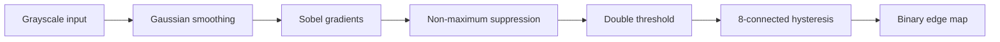

<div align="center">

# Vision2Autonomy

**Learn computer vision from first principles—one tested step at a time toward autonomous-driving perception.**

Theory · NumPy from scratch · Reproducible experiments · Automated tests · Bilingual documentation

**English** | [简体中文](README.zh-CN.md)

[](https://github.com/woofww/Vision2Autonomy/actions/workflows/tests.yml)
[](https://www.python.org/)
[](LICENSE)
[](src/vision2autonomy)
[](chapters)
[](https://woofww.github.io/Vision2Autonomy/)

</div>

> [!IMPORTANT]
> Vision2Autonomy is a **learning project**, not a collection of API snippets. Every topic must explain the principle, implement the essential mechanism, and demonstrate correctness. The current destination is autonomous-driving **visual perception**; planning and control are outside the present scope.

<table>
  <tr>
    <td align="center" width="50%">
      
      <br><sub><b>Chapter 01:</b> convolution, Gaussian smoothing, and sharpening</sub>
    </td>
    <td align="center" width="50%">
      
      <br><sub><b>Chapter 02:</b> from input pixels to a Canny edge map</sub>
    </td>
  </tr>
  <tr>
    <td align="center" width="50%">
      
      <br><sub><b>Chapter 06:</b> Hough voting and morphology clean the lane-like scene</sub>
    </td>
    <td align="center" width="50%">
      
      <br><sub><b>Chapter 07:</b> flow vectors track a moving rectangle and circle</sub>
    </td>
  </tr>
  <tr>
    <td align="center" width="50%">
      
      <br><sub><b>Chapter 08:</b> Zhang calibration recovers focal length and lens distortion</sub>
    </td>
    <td align="center" width="50%">
      
      <br><sub><b>Chapter 08:</b> undistortion straightens the grid with the recovered parameters</sub>
    </td>
  </tr>
</table>

## 📚 Contents

- [Purpose](#-purpose)
- [Learning method](#-learning-method)
- [Current progress](#-current-progress)
- [Quick start](#-quick-start)
- [Canny from scratch](#-canny-from-scratch)
- [Roadmap](#-roadmap)
- [Case quality standard](#-case-quality-standard)
- [Repository layout](#-repository-layout)
- [Testing and quality](#-testing-and-quality)
- [History](#-history)
- [Feedback](#-feedback)

## 🎯 Purpose

Computer-vision material often falls into one of two extremes: equations without a dependable implementation, or high-level API calls without an explanation of the machinery underneath. Vision2Autonomy builds a continuous path between the two:

```text
pixels and convolution
        ↓
classical image processing and features
        ↓
camera and multi-view geometry
        ↓
deep visual learning
        ↓
autonomous-driving perception
```

Algorithms initially favor clarity and inspectability. Optimized libraries, framework implementations, and performance comparisons come after the principle and correctness are established.

## 🧭 Learning method

Every topic follows the same loop:

1. **Understand** the problem, mathematics, assumptions, and design decisions.
2. **Implement** the essential steps with NumPy before hiding them behind an API.
3. **Observe** the exact input, meaningful intermediate states, and final output.
4. **Verify** against a simple reference, a known property, or a standard implementation.
5. **Test** normal behavior, boundary cases, invalid input, and the executable example.
6. **Reflect** on parameter sensitivity, failure modes, and possible improvements.

“From scratch” does not mean rejecting mature tools. It means understanding what OpenCV, PyTorch, and deployment runtimes do on our behalf.

## 🚦 Current progress

| Phase | Topics | Status | Documentation and result |
|---|---|:---:|---|
| 01 | Image arrays, 2-D convolution, Gaussian smoothing, sharpening | ✅ Complete | [Tutorial](chapters/01_image_foundations/README.md) · [Result](docs/assets/chapter01_convolution.png) |
| 02 | Sobel, NMS, double threshold, hysteresis, complete Canny | ✅ Complete | [Tutorial](chapters/02_edge_detection/README.md) · [Result](docs/assets/chapter02_canny_stages.png) |
| 03 | Structure tensor, eigenvalues, Harris corners, and NMS | ✅ Complete | [Tutorial](chapters/03_harris_corners/README.md) · [Teaching GIF](docs/assets/chapter03_harris_window.gif) |
| 04 | Patch descriptors, matching, normalized DLT, and RANSAC | ✅ Complete | [Tutorial](chapters/04_feature_matching/README.md) · [Match result](docs/assets/chapter04_ransac_inliers.png) |
| 05 | Pinhole projection, fundamental matrix, epipolar geometry, triangulation | ✅ Complete | [Tutorial](chapters/05_multiview_geometry/README.md) · [Depth result](docs/assets/chapter05_triangulated_depth.png) |
| 06 | Hough line detection and binary morphology | ✅ Complete | [Tutorial](chapters/06_hough_morphology/README.md) · [Lines](docs/assets/chapter06_hough_lines.png) · [Morphology](docs/assets/chapter06_morphology.png) |
| 07 | Lucas-Kanade optical flow and motion cues | ✅ Complete | [Tutorial](chapters/07_optical_flow/README.md) · [Flow](docs/assets/chapter07_optical_flow.png) · [GIF](docs/assets/chapter07_flow_tracking.gif) |
| 08 | Zhang camera calibration, lens distortion, and undistortion | ✅ Complete | [Tutorial](chapters/08_camera_calibration/README.md) · [Correction](docs/assets/chapter08_distortion_correction.png) · [GIF](docs/assets/chapter08_undistort.gif) |
| 09 | Classification, detection, segmentation, monocular depth | 🗓️ Planned | [Roadmap](docs/roadmap.md) |
| 10 | Lanes, drivable area, tracking, driving-perception integration | 🗓️ Planned | [Roadmap](docs/roadmap.md) |

> A phase is marked complete only when code, documentation, reference images, and tests are present. Plans are not presented as achievements.

## 🚀 Quick start

> New special reading: [Convolution Special — From Intuition and Physics to Images](chapters/special_convolution/README.md), explaining why the same operation appears in time systems, image processing, diffusion, frequency analysis, and neural networks.

### Why do these foundations matter for autonomous driving?


Convolution stabilizes pixels, edges propose lanes and contours, corners become repeatable landmarks, cross-frame matching supports motion estimation, and stereo disparity plus triangulation recover distance. Every chapter now includes an autonomous-driving role and a concrete failure case so the mathematics has a visible purpose.

Before installing anything, try the [interactive GitHub Pages labs](https://woofww.github.io/Vision2Autonomy/) for convolution, Canny, Harris, RANSAC, stereo depth, Hough line voting, Lucas-Kanade optical flow, and a lens-distortion calibration workbench.

```bash
git clone https://github.com/woofww/Vision2Autonomy.git
cd Vision2Autonomy
python -m venv .venv
```

Activate the environment:

```powershell
# Windows PowerShell
.\.venv\Scripts\Activate.ps1
```

```bash
# macOS / Linux
source .venv/bin/activate
```

Install, test, and regenerate the documented figures:

```bash
python -m pip install --upgrade pip
python -m pip install -e ".[dev]"
pytest
python -m vision2autonomy.examples.reference_images
```

The generator uses a fixed random seed. The tests run the same generation path in a temporary directory to prove that the figures remain reproducible.

## 🔍 Canny from scratch

Command line:

```bash
v2a-canny input.jpg edges.png \
  --low 40 --high 100 --sigma 1.4 --kernel-size 5
```

Python API:

```python
import numpy as np
from PIL import Image

from vision2autonomy.edges.canny import CannyResult, canny

image = np.asarray(Image.open("input.jpg").convert("L"))
result = canny(
    image,
    low_threshold=40,
    high_threshold=100,
    gaussian_size=5,
    sigma=1.4,
    return_intermediates=True,
)

assert isinstance(result, CannyResult)
Image.fromarray(result.edges).save("edges.png")
```



The core implementation does not call `cv2.Canny`. With `return_intermediates=True`, callers can inspect the smoothed image, gradient magnitude, direction, NMS response, and final edge map.

## 🗺️ Roadmap

- **Image foundations:** arrays, color spaces, convolution, filtering, gradients, and Canny.
- **Classical vision:** corners, features, Hough transforms, morphology, flow, and tracking.
- **Camera geometry:** calibration, homography, epipolar geometry, depth, and visual odometry.
- **Deep vision:** backpropagation, classification, detection, segmentation, and monocular depth.
- **Driving perception:** lanes, drivable areas, tracking, distance estimation, and real-time integration.

See the [complete roadmap](docs/roadmap.md) for milestones and scope boundaries.

## 🧪 Case quality standard

A case is complete only when it includes learning objectives, theory, a runnable reproduction command, exact input, meaningful intermediate figures, final output, parameter guidance, limitations, and an automated test. Derived figures must be generated by code, and both languages share the same experimental evidence.

See the full [case documentation standard](docs/CASE_STANDARD.md).

## 📁 Repository layout

```text
Vision2Autonomy/
├── src/vision2autonomy/          # installable library
│   ├── image/                    # convolution and filtering
│   ├── edges/                    # Sobel and Canny
│   ├── features/                 # Harris, local description, matching, and RANSAC
│   └── examples/                 # reproducible figure generators
├── chapters/                     # bilingual learning chapters
├── docs/assets/                  # code-generated reference figures
├── tests/                        # unit, integration, example, and docs tests
├── assignment/                   # original 2016 coursework
├── pyproject.toml
└── README.md
```

## ✅ Testing and quality

GitHub Actions runs the suite on Python 3.10 and 3.12. Tests cover numerical reference comparisons, Gaussian properties, Canny stages, CLI image I/O, deterministic figure generation, bilingual document pairs, and every local documentation link.

```bash
pytest
```

## 🕰️ History

This repository began as a 2016 computer-vision assignment. The original code and history remain in `assignment/`, while the modern project is rebuilt around an installable package, tests, CI, bilingual documentation, and reproducible experiments.

The history records an honest learning trajectory: from writing coursework to explaining, validating, and maintaining a complete vision system.

## 🤝 Feedback

- [Bug reports](https://github.com/woofww/Vision2Autonomy/issues/new)
- [Chapter suggestions](https://github.com/woofww/Vision2Autonomy/issues/new)
- [Pull requests](https://github.com/woofww/Vision2Autonomy/pulls)

Before contributing a case, read the [case documentation standard](docs/CASE_STANDARD.md) and ensure that `pytest` passes.

## 📄 License

This project is available under the [MIT License](LICENSE).

---

<div align="center">

**Understand before implementing. Verify before extending.**

If this learning project helps you, consider starring it or helping build the next chapter.

</div>
