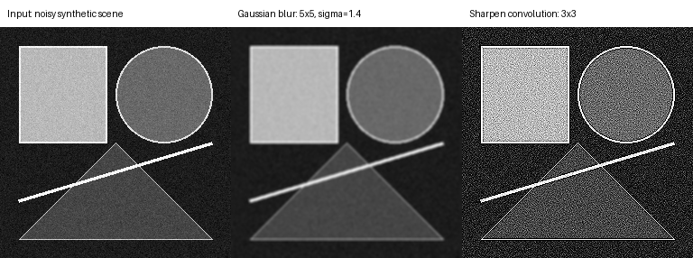
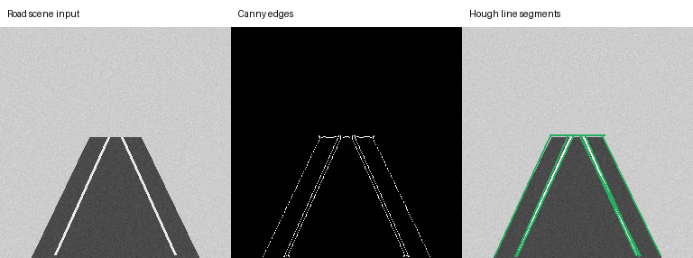
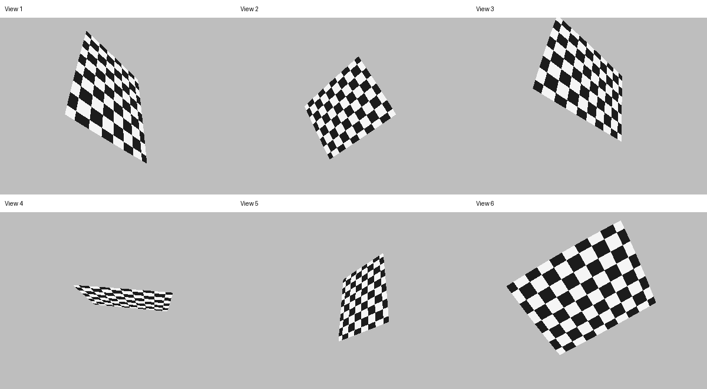
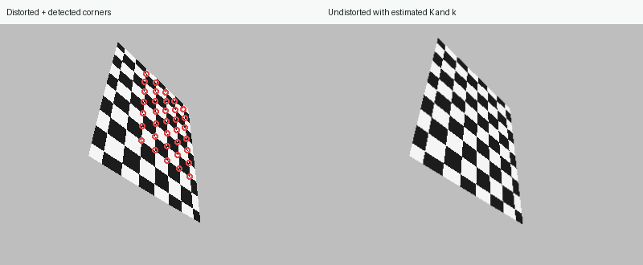
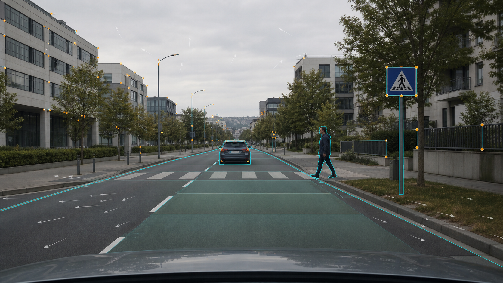
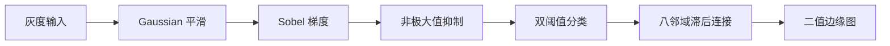

<div align="center">

# Vision2Autonomy

**从第一性原理学习计算机视觉，一步一步走向自动驾驶视觉感知。**

理论讲解 · NumPy 从零实现 · 可复现实验 · 自动化测试 · 中英双语

[English](README.md) | **简体中文**

[](https://github.com/woofww/Vision2Autonomy/actions/workflows/tests.yml)
[](https://www.python.org/)
[](LICENSE)
[](src/vision2autonomy)
[](chapters)
[](https://woofww.github.io/Vision2Autonomy/)

</div>

> [!IMPORTANT]
> Vision2Autonomy 首先是一个**学习项目**，不是算法调用示例合集。每个主题都必须回答三个问题：原理是什么、怎样从零实现、如何证明实现正确。当前终点是自动驾驶**视觉感知**，不包含尚未实现的规划与控制模块。

<table>
  <tr>
    <td align="center" width="50%">
      
      <br><sub><b>第一章：</b>卷积、Gaussian 平滑与锐化</sub>
    </td>
    <td align="center" width="50%">
      
      <br><sub><b>第二章：</b>从输入图到 Canny 边缘图</sub>
    </td>
  </tr>
  <tr>
    <td align="center" width="50%">
      
      <br><sub><b>第六章：</b>Hough 投票与形态学清理车道类场景</sub>
    </td>
    <td align="center" width="50%">
      
      <br><sub><b>第七章：</b>光流向量跟踪移动的矩形与圆形</sub>
    </td>
  </tr>
  <tr>
    <td align="center" width="50%">
      
      <br><sub><b>第八章：</b>Zhang 标定恢复焦距与镜头畸变</sub>
    </td>
    <td align="center" width="50%">
      
      <br><sub><b>第八章：</b>用恢复出的参数去畸变，让网格重新变直</sub>
    </td>
  </tr>
</table>

## 📚 目录

- [项目定位](#-项目定位)
- [学习方式](#-学习方式)
- [当前进度](#-当前进度)
- [快速开始](#-快速开始)
- [从零实现的 Canny](#-从零实现的-canny)
- [学习路线](#-学习路线)
- [案例质量标准](#-案例质量标准)
- [项目结构](#-项目结构)
- [测试与质量保证](#-测试与质量保证)
- [项目历史](#-项目历史)
- [参与和反馈](#-参与和反馈)

## 🎯 项目定位

很多计算机视觉教程存在两个极端：只讲公式却没有可靠实现，或者直接调用 OpenCV/PyTorch API 却没有解释内部过程。Vision2Autonomy 希望在两者之间建立一条连续学习路径：

```text
像素与卷积
    ↓
传统图像处理与特征
    ↓
相机模型与多视图几何
    ↓
深度学习视觉
    ↓
自动驾驶视觉感知
```

仓库中的算法优先采用清晰、可检查的实现。等原理和正确性得到验证后，再引入优化库、框架实现和性能对比。

## 🧭 学习方式

每个主题按照同一套闭环展开：

1. **理解**：解释问题、数学原理、假设和设计选择。
2. **实现**：先用 NumPy 写出关键步骤，而不是隐藏在高级 API 后面。
3. **观察**：保存输入、关键中间过程和最终输出图片。
4. **验证**：与简单参考算法、已知性质或标准实现进行对照。
5. **测试**：覆盖正常输入、边界条件、错误输入和完整示例路径。
6. **反思**：说明参数影响、失败场景和下一步改进方向。

“从零实现”不等于拒绝成熟工具。它的目标是让我们在使用 OpenCV、PyTorch 或部署框架时，知道它们替我们完成了什么。

## 🚦 当前进度

| 阶段 | 内容 | 状态 | 文档与结果 |
|---|---|:---:|---|
| 01 | 图像数组、二维卷积、Gaussian 平滑、锐化 | ✅ 已完成 | [中文教程](chapters/01_image_foundations/README.zh-CN.md) · [执行图](docs/assets/chapter01_convolution.png) |
| 02 | Sobel、NMS、双阈值、滞后连接、完整 Canny | ✅ 已完成 | [中文教程](chapters/02_edge_detection/README.zh-CN.md) · [执行图](docs/assets/chapter02_canny_stages.png) |
| 03 | 结构张量、特征值、Harris 角点与 NMS | ✅ 已完成 | [中文教程](chapters/03_harris_corners/README.zh-CN.md) · [教学 GIF](docs/assets/chapter03_harris_window.gif) |
| 04 | 补丁描述子、匹配、归一化 DLT 与 RANSAC | ✅ 已完成 | [中文教程](chapters/04_feature_matching/README.zh-CN.md) · [匹配结果](docs/assets/chapter04_ransac_inliers.png) |
| 05 | 针孔投影、基础矩阵、对极几何与三角化 | ✅ 已完成 | [中文教程](chapters/05_multiview_geometry/README.zh-CN.md) · [深度结果](docs/assets/chapter05_triangulated_depth.png) |
| 06 | Hough 直线检测与二值形态学 | ✅ 已完成 | [中文教程](chapters/06_hough_morphology/README.zh-CN.md) · [直线](docs/assets/chapter06_hough_lines.png) · [形态学](docs/assets/chapter06_morphology.png) |
| 07 | Lucas-Kanade 光流与运动线索 | ✅ 已完成 | [中文教程](chapters/07_optical_flow/README.zh-CN.md) · [光流](docs/assets/chapter07_optical_flow.png) · [GIF](docs/assets/chapter07_flow_tracking.gif) |
| 08 | Zhang 相机标定、镜头畸变与去畸变 | ✅ 已完成 | [中文教程](chapters/08_camera_calibration/README.zh-CN.md) · [去畸变](docs/assets/chapter08_distortion_correction.png) · [GIF](docs/assets/chapter08_undistort.gif) |
| 09 | 归一化 DLT、PnP、RANSAC 与相机位姿 | ✅ 已完成 | [中文教程](chapters/09_pnp_pose/README.zh-CN.md) · [对应关系](docs/assets/chapter09_pnp_correspondences.png) · [GIF](docs/assets/chapter09_pose_motion.gif) |
| 10 | PnP 视觉里程计、位姿累积、ATE 与漂移 | ✅ 已完成 | [中文教程](chapters/10_visual_odometry/README.zh-CN.md) · [轨迹](docs/assets/chapter10_vo_trajectory.png) · [GIF](docs/assets/chapter10_vo_trajectory.gif) |
| 11 | 分类、检测、分割、单目深度 | 🗓️ 规划中 | [路线图](docs/roadmap.zh-CN.md) |
| 12 | 车道、可行驶区域、目标跟踪、驾驶感知整合 | 🗓️ 规划中 | [路线图](docs/roadmap.zh-CN.md) |

> 进度表只标记仓库中已经有代码、文档、执行图和测试的内容，不用计划冒充成果。

## 🚀 快速开始

> 新增专题阅读：[《卷积特刊：从直觉、物理到图像》](chapters/special_convolution/README.zh-CN.md)——不从公式背诵开始，而是解释卷积为什么会同时出现在时间系统、图像处理、扩散方程和神经网络中。

### 为什么这些基础算法与自动驾驶有关？



卷积负责稳定像素，边缘提供车道和轮廓候选，角点形成可重复地标，跨帧匹配支持运动估计，双目视差与三角化恢复空间距离。每章都包含独立的“自动驾驶中的作用”与失效案例，帮助你带着目标学习，而不是孤立地背公式。

不安装任何依赖也可以先打开 [GitHub Pages 交互式实验室](https://woofww.github.io/Vision2Autonomy/)，直接体验卷积、Canny、Harris、RANSAC、双目深度、Hough 直线投票、Lucas-Kanade 光流、镜头畸变、PnP 位姿和视觉里程计漂移。

### 1. 获取代码

```bash
git clone https://github.com/woofww/Vision2Autonomy.git
cd Vision2Autonomy
```

### 2. 创建隔离环境

```bash
python -m venv .venv
```

Windows PowerShell：

```powershell
.\.venv\Scripts\Activate.ps1
```

macOS / Linux：

```bash
source .venv/bin/activate
```

### 3. 安装开发依赖并测试

```bash
python -m pip install --upgrade pip
python -m pip install -e ".[dev]"
pytest
```

### 4. 重新生成文档参考图

```bash
python -m vision2autonomy.examples.reference_images
```

生成器使用固定随机种子，输出会保存到 `docs/assets/`。测试套件也会在临时目录中执行同一条生成路径，确保文档图片可以被代码复现。

## 🔍 从零实现的 Canny

### 命令行使用

```bash
v2a-canny input.jpg edges.png \
  --low 40 \
  --high 100 \
  --sigma 1.4 \
  --kernel-size 5
```

### Python API

```python
import numpy as np
from PIL import Image

from vision2autonomy.edges.canny import CannyResult, canny

image = np.asarray(Image.open("input.jpg").convert("L"))
result = canny(
    image,
    low_threshold=40,
    high_threshold=100,
    gaussian_size=5,
    sigma=1.4,
    return_intermediates=True,
)

assert isinstance(result, CannyResult)
Image.fromarray(result.edges).save("edges.png")
```

### 流水线



核心实现没有调用 `cv2.Canny`。设置 `return_intermediates=True` 后可以获得平滑图、梯度幅值、梯度方向、NMS 结果和最终边缘图，便于逐步学习和调试。

## 🗺️ 学习路线

- **图像处理基础**：数组、颜色空间、卷积、滤波、梯度和 Canny。
- **传统计算机视觉**：角点、局部特征、Hough、形态学、光流和跟踪。
- **相机与多视图几何**：标定、Homography、对极几何、深度和视觉里程计。
- **深度视觉**：反向传播、分类、检测、分割、单目深度和多任务学习。
- **自动驾驶视觉感知**：车道、可行驶区域、目标跟踪、距离估计和实时整合。

完整里程碑和范围边界见[中文路线图](docs/roadmap.zh-CN.md)。

## 🧪 案例质量标准

每个案例只有同时满足以下条件才算完成：

- 有明确的学习目标、前置知识和原理说明；
- 有可以从仓库根目录执行的复现命令；
- 有确定的输入图片或注明来源的数据集样本；
- 有关键中间结果，而不只是最终输出；
- 有参数表、结果解读和已知局限；
- 有自动化测试覆盖示例执行路径；
- 派生图片由代码生成，不经过人工修图；
- 中英文文档引用同一组实验结果。

完整约定见[案例文档规范](docs/CASE_STANDARD.zh-CN.md)。

## 📁 项目结构

```text
Vision2Autonomy/
├── src/vision2autonomy/          # 可安装的正式库
│   ├── image/                    # 卷积与图像滤波
│   ├── edges/                    # Sobel 与 Canny
│   ├── features/                 # Harris、局部描述、匹配与 RANSAC
│   └── examples/                 # 可复现图片生成器
├── chapters/                     # 中英文学习章节
├── docs/assets/                  # 代码生成的参考图片
├── tests/                        # 单元、集成、示例和文档测试
├── assignment/                   # 2016 年原始课程作业
├── pyproject.toml
└── README.zh-CN.md
```

## ✅ 测试与质量保证

GitHub Actions 在 Python 3.10 和 3.12 上运行完整测试。当前测试范围包括：

- 向量化卷积与双重循环参考实现逐元素对照；
- Gaussian 核归一化、对称性和常量保持性质；
- 已知阶跃边缘的 Canny 定位；
- NMS、双阈值和八邻域滞后连接；
- Harris 角点定位、结构张量特征值和最小距离约束；
- CLI 端到端图片读写；
- 参考图片的确定性生成和 PNG 完整性；
- 中英文文档成对存在；
- 所有本地文档链接与图片路径有效。

```bash
pytest
```

## 🕰️ 项目历史

这个仓库最初是一份 2016 年的计算机视觉课程作业。旧代码和提交历史被保留在 `assignment/`，新的代码库则以现代 Python 包、测试、CI、双语文档和可复现实验重新建设。

保留历史不是为了把旧代码包装成新成果，而是为了诚实记录一条学习轨迹：从能写出课程作业，到能够解释、验证并维护一套完整视觉系统。

## 🤝 参与和反馈

- [Bug 报告](https://github.com/woofww/Vision2Autonomy/issues/new)
- [章节建议](https://github.com/woofww/Vision2Autonomy/issues/new)
- [Pull Request](https://github.com/woofww/Vision2Autonomy/pulls)

提交新案例前，请阅读[案例文档规范](docs/CASE_STANDARD.zh-CN.md)，并确保 `pytest` 全部通过。

## 📄 许可证

本项目采用 [MIT License](LICENSE)。

---

<div align="center">

**先理解，再实现；先验证，再扩展。**

如果这个学习项目对你有帮助，欢迎 Star 或一起完善下一章。

</div>
