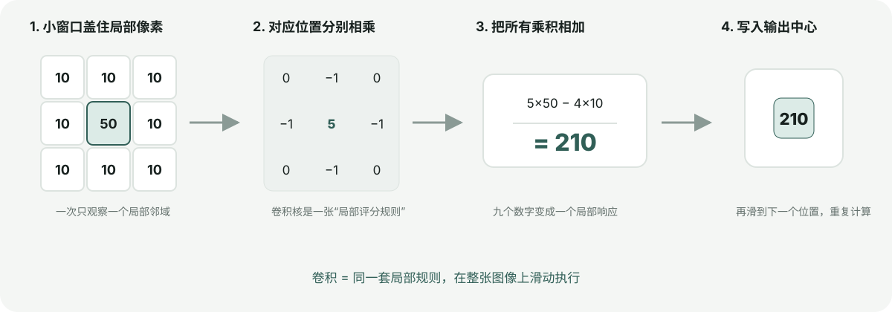
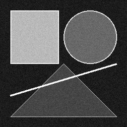

# Chapter 01: Image foundations

[English](README.md) | [简体中文](README.zh-CN.md)

This chapter establishes the numerical operations used throughout the rest of
the project. We represent a grayscale image as a two-dimensional NumPy array,
implement true two-dimensional convolution, and use it to build Gaussian
smoothing and sharpening examples.

> If it is still unclear why convolution appears in time systems, images, and neural networks, begin with the standalone [Convolution Special](../special_convolution/README.md).

## Learning objectives

After completing this chapter, you should be able to:

- explain the difference between convolution and cross-correlation;
- predict how kernel size and padding affect the output;
- construct and normalize a two-dimensional Gaussian kernel;
- apply a linear filter without changing image dimensions;
- verify a vectorized implementation against a simple reference algorithm.

Prerequisites are basic Python, NumPy indexing, and matrix multiplication.

## Image representation

An 8-bit grayscale image stores one intensity per pixel:

```text
0   = black
255 = white
```

The library immediately converts input to `float64` while calculating. This is
important because kernels can contain negative or fractional values; calculating
directly in `uint8` would overflow or discard information. Conversion back to
`uint8` happens only when an image is saved for display.

## Before the formula: what does convolution mean?

Think of convolution as carrying a small **local scoring rule** across an image. At each position, the rule looks at nearby pixels and produces one score. Similar positive weights smooth; a large positive center surrounded by negatives emphasizes contrast; opposite signs on the left and right respond to vertical edges.



Each position uses four steps: cover a local window, multiply corresponding values, add the products, and write the result at the output center. Then slide onward. Convolution is not mysterious image blending; it is **one local rule repeated everywhere**.

For the illustrated sharpening example, the center is 50 and its four neighbors are 10:

```text
5×50 − 4×10 = 210
```

The bright center is emphasized. If every pixel were 10, the result would remain `5×10−4×10=10`. The completed output is a response map. Sobel, Harris, and convolutional neural networks all build on this idea with different designed or learned local rules.

## Mathematical two-dimensional convolution

For image `I` and kernel `K`, an output pixel is

```text
O[y, x] = sum_i sum_j I[y - i, x - j] K[i, j]
```

The sign in `y - i, x - j` means the kernel is flipped horizontally and
vertically. Many image libraries actually implement correlation and call it
convolution. `convolve2d` performs the mathematical convolution explicitly.

The implementation:

1. validates that the image is two-dimensional;
2. requires odd kernel dimensions so there is an unambiguous center;
3. pads the image using `reflect`, `edge`, or `constant` mode;
4. creates a view of every local window with `sliding_window_view`;
5. multiplies all windows by the flipped kernel with `einsum`.

`reflect` is the default padding mode because it avoids introducing an
artificial black border, although no padding choice is universally correct.

## Gaussian smoothing

The two-dimensional Gaussian is

```text
G(x, y) = exp(-(x² + y²) / (2 sigma²))
```

The sampled kernel is divided by its sum, making the weights add to one. A
constant image therefore remains constant after filtering. `sigma` controls the
spread: a larger value removes more high-frequency detail but also weakens and
shifts fine edges.

## Executable example

Generate every reference image from the repository root:

```bash
python -m pip install -e ".[dev]"
python -m vision2autonomy.examples.reference_images
```

The input is generated deterministically with seed `7`. It contains flat
regions, curved and diagonal boundaries, thin lines, high-contrast transitions,
and Gaussian noise so that several filter behaviors appear in one small image.



The comparison below is produced by the same command:


### Parameters

| Operation | Kernel | Parameters | Purpose |
|---|---:|---|---|
| Gaussian blur | 5 × 5 | `sigma=1.4` | Reduce noise before later edge detection |
| Sharpen | 3 × 3 | center weight `5`, neighbour weight `-1` | Increase local contrast around boundaries |
| Padding | — | `reflect` | Preserve dimensions without a black frame |

### Reading the result

- The Gaussian result has smoother regions and less visible speckle, but thin
  structures and object boundaries are softened.
- The sharpening kernel increases contrast at boundaries and also amplifies
  noise. This illustrates why denoising normally precedes gradient detection.
- All panels have the same dimensions because convolution returns a same-sized
  result.

### Limitations

- Direct two-dimensional convolution becomes expensive for large kernels.
  Gaussian filtering is separable and can later be optimized into two 1-D passes.
- Reflect padding assumes content outside the image mirrors the visible border.
- Display clipping hides negative and greater-than-255 sharpening responses;
  numerical callers receive the unclipped floating-point array.

## Verification

Run the focused tests:

```bash
pytest tests/test_convolution.py tests/test_filters.py tests/test_examples.py
```

The test suite compares vectorized convolution against a deliberately simple
nested-loop implementation, verifies Gaussian symmetry and normalization,
checks that constant images remain constant, and regenerates every example PNG.

Reusable code lives in `src/vision2autonomy/image/`.
## Autonomous-driving role: turning camera pixels into reliable signals


A driving camera begins with noisy pixels affected by exposure and motion blur. Convolution and Gaussian smoothing are shared foundations for lane edges, sign corners, and object texture. Sharpening can reveal structure but can also amplify sensor noise. Every road user in the illustration must first pass through this numerical layer.

**Example:** smoothing can stabilize gradients at dusk, while incorrect numeric ranges or overflow can create false edges in wet-road reflections.
