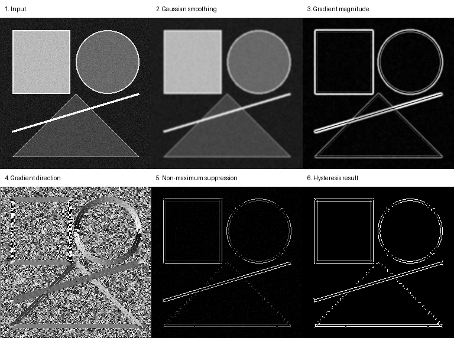
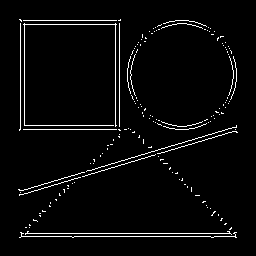

# 第二章：边缘检测

[English](README.md) | [简体中文](README.zh-CN.md)

本章在不调用 `cv2.Canny` 的前提下，从零构建完整的 Canny 边缘检测器。Canny 不只是一个独立功能，它将图像平滑、离散微分、方向几何、阈值分类和图搜索连接成一条完整流水线，并且每个中间结果都可以被检查和测试。

## 学习目标

完成本章后，你应该能够：

- 使用 Sobel 核计算水平和垂直方向导数；
- 从梯度分量计算幅值与方向；
- 解释为何直接对梯度进行阈值处理会得到较粗的边缘；
- 使用非极大值抑制将梯度脊线细化；
- 区分强边缘、弱候选边缘和背景；
- 使用滞后连接保留与强边缘相连的弱响应；
- 通过中间结果定位 Canny 参数或实现问题。

## 一、完整处理流程

### 1. Gaussian 平滑

随机噪声可能产生很大的局部导数，从而被误判为边缘。因此，算法首先使用归一化 Gaussian 核对输入图像进行平滑。当前案例使用 `5 × 5` 卷积核和 `sigma=1.4`。

平滑强度需要权衡：太弱会保留大量噪声，太强则会抹去真实的细小结构。

### 2. Sobel 梯度

使用以下两个 `3 × 3` Sobel 核估计水平和垂直导数：

```text
Gx = [-1  0  1]    Gy = [-1 -2 -1]
     [-2  0  2]         [ 0  0  0]
     [-1  0  1]         [ 1  2  1]
```

梯度幅值和方向为：

```text
magnitude = sqrt(Gx² + Gy²)
direction = atan2(Gy, Gx)
```

方向被归一化到 `[0, 180)`。原因是，法向量朝向 0° 和朝向 180° 描述的是同一条无方向边缘。

### 3. 非极大值抑制

梯度幅值图中的边界往往是几像素宽的亮带，而不是单像素线。非极大值抑制将每个方向归入 0°、45°、90° 或 135° 四个区间，并沿梯度方向比较相邻两个像素。

只有当当前像素幅值不小于两侧邻居时才保留，否则将其设为零。这样可以把宽梯度脊线细化为接近单像素的边缘。

### 4. 双阈值分类

对细化后的响应应用两个阈值：

```text
magnitude >= high                 强边缘
low <= magnitude < high           弱候选边缘
magnitude < low                    背景
```

单阈值无法同时表达“非常可信的边缘”和“可能是真实边缘延续部分的微弱响应”。双阈值保留了这种不确定性，交给下一步通过连通性判断。

### 5. 滞后连接

所有强边缘像素首先进入队列。程序从这些种子出发进行八邻域图搜索，将能够通过弱候选像素连接到强边缘的路径全部保留。

孤立弱响应会被删除。最终输出约定如下：

```text
255 = 边缘
0   = 背景
```

## 二、复现参考结果

在仓库根目录执行：

```bash
python -m pip install -e ".[dev]"
python -m vision2autonomy.examples.reference_images
```

脚本使用第一章介绍的固定种子合成场景，并将每个显示面板保存到 `docs/assets/`。



最终二值边缘图也会单独保存：



## 三、案例参数

| 参数 | 取值 | 影响 |
|---|---:|---|
| `gaussian_size` | `5` | 平滑邻域大小 |
| `sigma` | `1.4` | Gaussian 平滑强度 |
| `low_threshold` | `35` | 可以参与边缘连接的最低响应 |
| `high_threshold` | `90` | 直接作为强边缘种子的最低响应 |

阈值作用于原始 Sobel 幅值，而不是为了显示而归一化的灰度值。

- 同时提高两个阈值会减少边缘数量；
- 同时降低会保留更多纹理和噪声；
- 增大 `sigma` 会在阈值处理前去除更多细节；
- `low_threshold` 过低可能让噪声通过连通链连接到真实边缘；
- `high_threshold` 过高则可能缺少足够的强边缘种子。

## 四、Python API

```python
import numpy as np
from PIL import Image

from vision2autonomy.edges.canny import CannyResult, canny

image = np.asarray(Image.open("input.png").convert("L"))
result = canny(
    image,
    low_threshold=35,
    high_threshold=90,
    return_intermediates=True,
)
assert isinstance(result, CannyResult)
Image.fromarray(result.edges).save("edges.png")
```

如果只需要最终输出，可以直接运行命令行工具：

```bash
v2a-canny input.png edges.png --low 35 --high 90 --sigma 1.4 --kernel-size 5
```

`return_intermediates=True` 返回以下数组：

- `smoothed`：Gaussian 平滑结果；
- `magnitude`：Sobel 梯度幅值；
- `direction`：归一化到 `[0, 180)` 的梯度方向；
- `suppressed`：非极大值抑制结果；
- `edges`：滞后连接后的二值边缘图。

## 五、结果分析

- 平滑图中的随机颗粒明显减少，主要形状仍然可辨认。
- 梯度幅值在矩形、圆形、三角形和明亮线段附近形成高响应。
- 细亮线两侧均可能产生梯度，因为强度在进入和离开线段时分别变化。
- 梯度方向图是角度的灰度可视化，不表示边缘强弱，不能像普通强度图一样解读。
- 非极大值抑制显著减少宽边缘，只保留局部幅值峰值。
- 滞后连接保留了与强边缘相连的弱片段，同时删除大量孤立噪声。
- 圆弧和斜线处可能出现细小断裂，这与四方向量化、离散像素网格和阈值选择有关。

## 六、已知局限和后续改进

- 当前 NMS 使用四个方向区间。按照真实角度对相邻幅值进行插值可以改善定位精度。
- 绝对阈值依赖图像强度和对比度。相对阈值或分位数阈值可以提供更自适应的默认值。
- 当前实现优先考虑清晰和可读性，而不是实时性能。后续会与优化实现进行耗时和内存对比。
- 合成图适合验证算法步骤，但不能代替真实数据集评估。
- 最终需要在带边缘标注的数据集上报告 Precision、Recall、F1、ODS、OIS 或 AP 等指标。

## 七、测试与验证

运行本章相关测试：

```bash
pytest tests/test_canny.py tests/test_cli.py tests/test_examples.py
```

测试覆盖：

- 常量图像不产生边缘；
- 已知垂直阶跃边缘被定位在正确列附近；
- 非极大值抑制只保留指定方向上的局部峰值；
- 八邻域滞后连接保留连通弱边缘并删除孤立响应；
- 非法阈值、彩色输入和非有限数值被拒绝；
- CLI 能够读取图片并写出有效边缘图；
- 文档中的四张参考图可以在临时目录完整重新生成。

核心实现位于 `src/vision2autonomy/edges/canny.py`。

