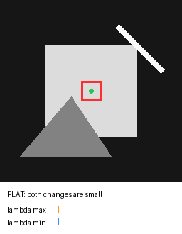
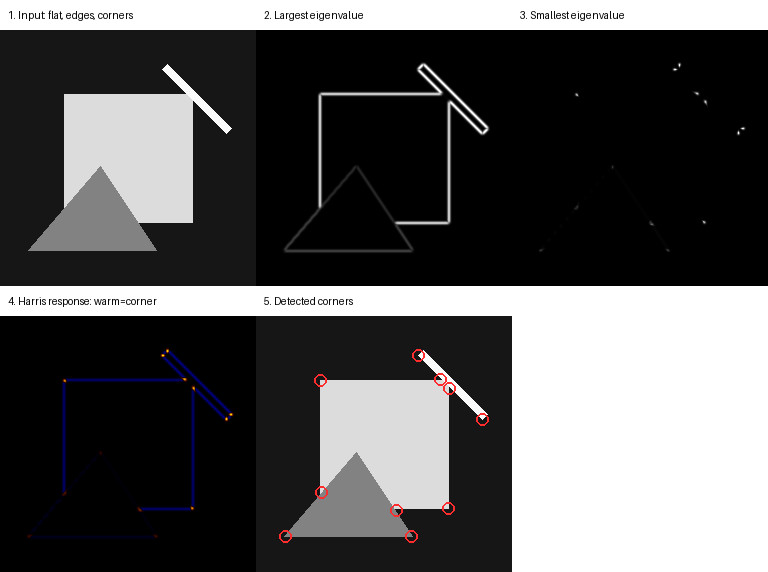
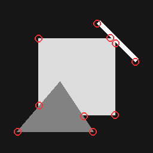

# 第三章：Harris 角点检测

[English](README.md) | [简体中文](README.zh-CN.md)

前两章解决了“哪里发生了亮度变化”，本章继续回答一个更适合定位和匹配的问题：**哪些局部位置在两个方向上都具有稳定、独特的变化？** 这类位置就是角点。

角点是特征匹配、目标跟踪、图像拼接、相机位姿估计、视觉里程计和 SLAM 的基础。Harris 检测器把卷积、梯度和局部矩阵分析组合成一个经典而清晰的角点模型。



## 学习目标

完成本章后，你应该能够：

- 解释为什么平坦区域、边缘和角点对窗口平移的反应不同；
- 从图像梯度推导二阶矩矩阵（结构张量）；
- 使用两个特征值区分平坦区、边缘和角点；
- 理解 Harris 响应 `R = det(M) - k trace(M)²`；
- 使用相对阈值、局部极大值和最小距离筛选角点；
- 分析 Harris 对尺度、噪声、阈值和窗口大小的敏感性。

前置内容：第一章卷积与 Gaussian 平滑、第二章 Sobel 梯度。

## 一、为什么边缘不够稳定

假设在图像中取一个小窗口，然后轻微移动它：

- **平坦区域**：向任何方向移动，窗口内容几乎不变；
- **边缘区域**：垂直于边缘移动时变化明显，沿边缘移动时变化很小；
- **角点区域**：向大多数方向移动，窗口内容都会明显变化。

沿一条长直边，我们很难仅靠局部外观判断自己处于边缘的哪个位置，这就是孔径问题的一种直观表现。角点在两个方向上都有约束，因此更适合重复定位。

动画中的红框是观察窗口，橙色和蓝色条分别表示结构张量的最大、最小特征值：

```text
平坦区：lambda1 小，lambda2 小
边缘：  lambda1 大，lambda2 小
角点：  lambda1 大，lambda2 大
```

## 二、从窗口位移到结构张量

用平方差衡量窗口平移 `(u, v)` 后的变化：

```text
E(u, v) = sum w(x, y) [I(x+u, y+v) - I(x, y)]²
```

其中 `w(x, y)` 是窗口权重，本项目使用 Gaussian 权重，让中心附近像素贡献更大。

对于很小的位移，可以使用一阶 Taylor 近似：

```text
I(x+u, y+v) ≈ I(x, y) + Ix·u + Iy·v
```

代入平方差并整理：

```text
E(u, v) ≈ [u v] M [u v]ᵀ
```

局部二阶矩矩阵为：

```text
M = [ G(Ix²)   G(IxIy) ]
    [ G(IxIy)  G(Iy²)  ]
```

`Ix`、`Iy` 由 Sobel 得到，`G` 表示 Gaussian 加权求和。矩阵 `M` 总结了窗口内两个方向的梯度分布，因此也常被称为结构张量。

## 三、两个特征值在说什么

对称矩阵 `M` 有两个实特征值 `lambda1 >= lambda2`。可以把它们理解为：窗口沿两个主要方向移动时，图像内容变化有多强。

| 区域 | 最大特征值 | 最小特征值 | 含义 |
|---|---:|---:|---|
| 平坦区 | 小 | 小 | 所有方向都缺少变化 |
| 边缘 | 大 | 小 | 只有一个主要变化方向 |
| 角点 | 大 | 大 | 两个方向都有明显变化 |

下面的执行图依次展示输入、最大特征值、最小特征值、Harris 响应和最终角点：



最大特征值图会在大多数边缘上发亮，而最小特征值只在角点附近明显。这个对比正是 Harris 分类的核心。

## 四、Harris 响应

直接对每个像素做特征值阈值判断可以工作，但 Harris 提出了一个不需要显式特征分解的评分：

```text
R = det(M) - k · trace(M)²

det(M)   = lambda1 · lambda2
trace(M) = lambda1 + lambda2
```

典型解释：

- `R` 接近零：平坦区域；
- `R` 为较大负值：边缘；
- `R` 为较大正值：角点。

经验参数 `k` 通常位于 `0.04` 到 `0.06`。本章使用 `0.04`。`k` 越大，对边缘惩罚越强，但也可能压低一些弱角点。

代码仍然计算两个特征值并返回它们，不是检测所必需，而是为了让学习者能够验证和观察矩阵含义。

## 五、为什么还需要 NMS 和最小距离

一个几何角点周围通常会形成一小片正响应，而不是唯一像素。直接阈值化会在同一个角点附近返回多个坐标。

本项目的筛选过程：

1. 使用 `threshold_rel × max(R)` 删除弱响应；
2. 在 `(2d+1) × (2d+1)` 邻域内保留局部最大值；
3. 按响应从强到弱排序；
4. 贪心保留与已选角点至少相距 `min_distance` 的候选；
5. 可选地通过 `max_corners` 限制数量。

返回坐标采用 NumPy 顺序 `(row, column)`，绘图时要转换成 `(x, y) = (column, row)`。

## 六、复现实验

安装项目并生成全部参考资产：

```bash
python -m pip install -e ".[dev]"
python -m vision2autonomy.examples.reference_images
```

生成内容：

- `chapter03_harris_stages.png`：完整中间阶段；
- `chapter03_harris_corners.png`：最终角点覆盖图；
- `chapter03_harris_window.gif`：窗口从平坦区移动到边缘和角点的动画。



## 七、Python API

```python
import numpy as np
from PIL import Image

from vision2autonomy.features.harris import detect_harris_corners

image = np.asarray(Image.open("input.png").convert("L"))
result = detect_harris_corners(
    image,
    k=0.04,
    window_size=5,
    sigma=1.0,
    threshold_rel=0.03,
    min_distance=12,
    max_corners=100,
)

print(result.corners)       # (row, column)
print(result.response.shape)
```

`HarrisResult` 提供：

- `response`：每个像素的 Harris 分数；
- `lambda_max`：结构张量较大特征值；
- `lambda_min`：结构张量较小特征值；
- `corners`：经过阈值、NMS 和距离约束后的角点坐标。

## 八、参数说明

| 参数 | 本案例值 | 作用 | 调大后的典型影响 |
|---|---:|---|---|
| `k` | `0.04` | 边缘惩罚系数 | 更严格地区分边缘和角点 |
| `window_size` | `5` | 结构张量聚合窗口 | 更稳定，但定位更粗、细小角点可能消失 |
| `sigma` | `1.0` | 窗口 Gaussian 权重 | 对局部变化更平滑 |
| `threshold_rel` | `0.03` | 相对最大响应的阈值 | 角点更少、更强 |
| `min_distance` | `12` | 角点最小间距 | 输出更稀疏 |
| `max_corners` | `16` | 最大角点数量 | 只保留更强候选 |

## 九、结果分析

- 正方形的四个角有强正响应；长直边主要表现为负响应。
- 斜线的两个端点会被检测，因为线段结束处在两个方向上产生变化。
- 三角形顶点被保留，而三条边的大部分位置不会成为角点。
- 最大特征值图显示几乎所有强边缘；最小特征值图集中在角和端点。
- 红圈数量由相对阈值、最小距离和最大数量共同决定，不是物体角点总数的绝对真值。

## 十、局限与后续方向

- Harris 对图像旋转较稳定，但不具备天然尺度不变性；同一角点缩放后可能需要不同窗口。
- 它检测位置，不提供用于匹配的描述子。下一步需要学习局部描述和匹配。
- 亮度和对比度变化会改变梯度幅值，从而影响绝对响应。
- 像素级 NMS 的定位精度有限，可以进一步做亚像素角点优化。
- 重复纹理会产生许多外观相似的角点，仅靠检测器无法解决匹配歧义。

## 十一、测试与验证

```bash
pytest tests/test_harris.py tests/test_examples.py tests/test_documentation.py
```

测试覆盖：

- 常量图响应为零且没有角点；
- 合成正方形的四个几何角被定位在允许误差内；
- 角点具有两个较大特征值，而边缘只有一个；
- 角点按强度排序并满足最小距离；
- 非法参数和彩色输入被拒绝；
- GIF 确实包含多个动画帧；
- 所有参考资产可由代码重新生成；
- 中英文文档和图片链接有效。

核心实现位于 `src/vision2autonomy/features/harris.py`。

