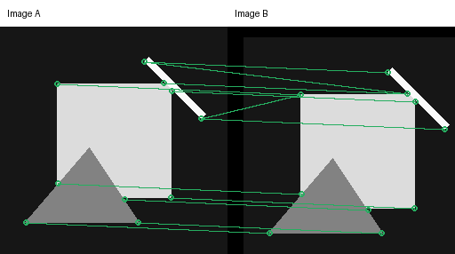
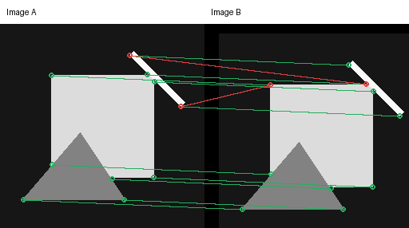

# Chapter 04: From Corners to Matching and RANSAC

[English](README.md) | [简体中文](README.zh-CN.md)

> This chapter asks how two corners in different images can be recognized as the same physical location.

## Learning objectives

You will learn to separate detection, description, matching, and geometric verification; implement normalized patch descriptors; apply nearest-neighbor ratio and mutual checks; estimate a homography with normalized DLT; and recover a model from outliers with deterministic RANSAC.

## Pipeline

```text
Images A/B → Harris keypoints → patch descriptors → nearest neighbors
           → ratio/mutual checks → RANSAC → homography + inliers
```

A detector says where to look. A descriptor encodes local appearance, a matcher compares that appearance, and RANSAC tests whether the proposed correspondences agree with one geometric motion. Appearance similarity alone is not geometric correctness.

## Normalized patch descriptor

Flatten a `p×p` grayscale patch around each keypoint and normalize it:

```math
d = \frac{x-\bar{x}}{\max(\lVert x-\bar{x}\rVert_2, \epsilon)}
```

Mean subtraction reduces sensitivity to brightness offsets; L2 normalization reduces sensitivity to global contrast. Border keypoints are omitted rather than padded. This baseline is intentionally not rotation- or scale-invariant, making the motivation for later SIFT/ORB-style designs explicit.

## Matching and ambiguity

For a descriptor, compare the closest and second-closest distances:

```math
r = \frac{\lVert d_i-d_1\rVert_2}{\lVert d_i-d_2\rVert_2}
```

A small ratio means the winner is distinctive; a ratio near one signals ambiguity. Mutual matching additionally requires A's best B candidate to choose A in return.



The deterministic example translates the scene by 12 rows and 18 columns. Two ambiguous candidates are inserted by the generator so geometric rejection remains visible and reproducible.

## Homography and normalized DLT

Planar or pure-rotation correspondences satisfy

```math
s[u,v,1]^T = H[x,y,1]^T.
```

A homography has eight independent degrees of freedom and needs at least four non-degenerate pairs. The implementation centers and scales both point sets to mean distance `√2`, builds `Ah=0`, takes the right singular vector associated with the smallest singular value, and denormalizes the result. Convert feature coordinates from `(row, column)` to geometric `(x, y)` first.

## RANSAC

Each iteration samples four pairs, fits a candidate homography, measures reprojection error for every match, and keeps the consensus with the most inliers. The final matrix is refit using all inliers.



Green lines are consistent inliers; red lines are rejected candidates. The fixed seed makes the experiment repeatable.

## Reproduce

```bash
python -m pip install -e ".[dev]"
python -m vision2autonomy.examples.reference_images
pytest tests/test_matching.py -q
```

```python
da = describe_patches(image_a, corners_a, patch_size=11)
db = describe_patches(image_b, corners_b, patch_size=11)
matches = match_descriptors(da.descriptors, db.descriptors, ratio_threshold=0.8)
src_xy = da.keypoints[matches.pairs[:, 0]][:, ::-1]
dst_xy = db.keypoints[matches.pairs[:, 1]][:, ::-1]
model = ransac_homography(src_xy, dst_xy, threshold=2.0, seed=11)
```

## Parameters

| Parameter | Default | Meaning | Larger value |
|---|---:|---|---|
| `patch_size` | 9 | local support width | more context, less deformation tolerance |
| `ratio_threshold` | 0.8 | ambiguity cutoff | more matches and more false-match risk |
| `mutual` | `True` | bidirectional agreement | disabling raises recall and lowers reliability |
| `threshold` | 2.0 px | RANSAC inlier error | tolerates noise and possibly bad matches |
| `max_iterations` | 1000 | random hypotheses | higher success probability and runtime |
| `seed` | 0 | sample sequence | fixed values make results reproducible |

## Autonomous-driving connection


The white motion vectors indicate local structures moving between adjacent frames. Matches on buildings and signs mainly encode ego motion; matches on vehicles and pedestrians include independent object motion. RANSAC seeks the dominant static-background consensus within this mixture.

Cross-frame matches support visual odometry, localization, map association, multi-camera calibration, and triangulation. Repeated lane markings, low-texture roads, dynamic vehicles, blur, and exposure changes are common failure cases. A homography only models a plane or near-pure camera rotation; the next geometry chapter introduces camera models, epipolar constraints, and 3D triangulation.

## Check your understanding

1. Why does a strong Harris response not guarantee a correct match?
2. Why do repeated lane markings make the nearest-neighbor ratio approach one?
3. What happens to direct DLT when one of four pairs is wrong?
4. Why is the RANSAC threshold measured in pixels?
5. Why can a homography not model a road scene with strong parallax?
