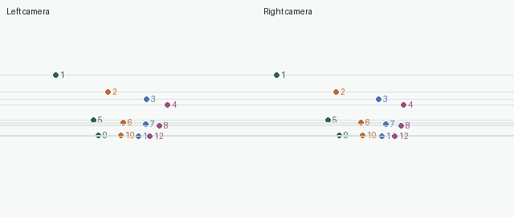
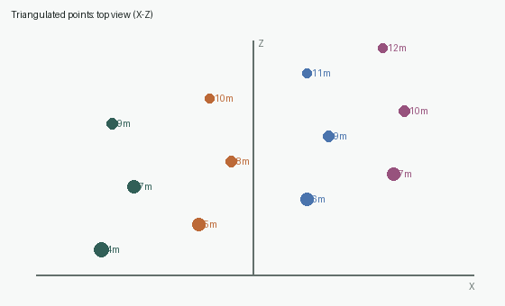

# Chapter 05: Pinhole Cameras, Epipolar Geometry, and Triangulation

[English](README.md) | [简体中文](README.zh-CN.md)

> One image compresses a 3D world into 2D. A second viewpoint supplies disparity, allowing depth to be recovered.

## Learning objectives

This chapter covers the intrinsic matrix `K`, extrinsics `[R|t]`, pinhole projection, normalized eight-point estimation of `F`, epipolar lines, Sampson error, and linear triangulation with known camera matrices.

## Pinhole projection

```math
s x = K[R|t]X = PX
```

Perspective division gives `u=f_x X_c/Z_c+c_x` and `v=f_y Y_c/Z_c+c_y`. A pixel therefore identifies a 3D ray, not a unique 3D point.

For rectified stereo,

```math
Z=\frac{fB}{d},\qquad d=u_L-u_R.
```

Small disparity means large depth. The same subpixel matching error consequently causes much larger depth uncertainty for distant objects.

## Epipolar constraint

Correct matches satisfy `x'^T F x=0`; a point in one image maps to a line `l'=Fx` in the other. This reduces correspondence search from a 2D image to a 1D line.



The deterministic example uses rectified cameras, so corresponding epipolar lines are horizontal. Near points exhibit larger horizontal disparity.

## Normalized eight-point algorithm

Center and scale each image's points to mean radius `√2`, build `Af=0`, solve by SVD, force the smallest singular value of `F` to zero, and denormalize. Enforcing rank two is a geometric constraint; point normalization improves numerical conditioning for pixel-scale coordinates.

Sampson error provides a first-order geometric distance:

```math
e=\frac{(x'^TFx)^2}{(Fx)_1^2+(Fx)_2^2+(F^Tx')_1^2+(F^Tx')_2^2}.
```

## Linear triangulation

Each match produces four rows from `x×PX=0`. SVD of that `4×4` homogeneous system yields a 3D homogeneous point, which is converted to Cartesian `(X,Y,Z)`.



## Reproduce

```bash
python -m pip install -e ".[dev]"
python -m vision2autonomy.examples.reference_images
pytest tests/test_multiview.py -q
```

```python
P1 = camera_matrix(K, R1, t1)
P2 = camera_matrix(K, R2, t2)
F = estimate_fundamental(points_left, points_right)
errors = sampson_errors(points_left, points_right, F)
points_3d = triangulate_points(P1, P2, points_left, points_right)
```

## Conventions and common failures

| Quantity | Convention | Frequent mistake |
|---|---|---|
| image point | `(x,y)=(column,row)` pixels | mixing NumPy row-column order |
| focal length | pixels | inserting millimeters directly |
| baseline | world units | inconsistent units with 3D points |
| `F` | rank two, arbitrary scale | comparing raw entries without normalization |
| depth | camera Z coordinate | confusing depth with Euclidean range |

## Autonomous-driving connection


The translucent road bands represent depth layers. Pixel locations for the lead car and pedestrian become actionable distances only after calibration, disparity, and camera geometry are combined. Disparity shrinks with range, so distant depth is less certain.

These primitives support stereo depth, visual odometry, landmark creation, localization, multi-camera consistency, and ground-plane bird's-eye projection. Production systems must additionally handle distortion, synchronization, rolling shutter, dynamic objects, occlusion, and calibration drift. A later chapter will recover relative camera pose from the essential matrix and connect triangulation to PnP and visual odometry.

## Check your understanding

1. Why does one pixel not determine depth?
2. Why are rectified stereo epipolar lines horizontal?
3. Why is distant depth less stable?
4. Why must the eight-point result be forced to rank two?
5. Why must bad matches be removed before triangulation?
