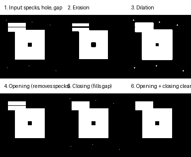

# 第 06 章：Hough 变换与二值形态学

[English](README.md) | [简体中文](README.zh-CN.md)

> 边缘告诉我们“哪里发生了亮度变化”，Hough 变换告诉我们“这些变化构成了什么几何形状”，形态学则负责清理后续的二值图像。

## 学习目标

- 用直线法线式 `rho = x*cos(theta) + y*sin(theta)` 表示直线；
- 让每个边缘像素投票，构建 Hough 累加器；
- 提取强且分离的峰值，并转换成可绘制的线段；
- 理解量化分辨率和邻域抑制对检测的影响；
- 用结构元素实现二值腐蚀与膨胀；
- 组合出开运算与闭运算，并知道各自适用的场景。

## 1. 从点回到直线：投票

平面内的一条直线可以用两个参数 `(rho, theta)` 表示：

```math
\rho = x\cos\theta + y\sin\theta
```

`theta` 是直线法向量的角度，`rho` 是图像原点到直线的带符号距离。固定一个像素 `(x, y)`，让 `theta` 变化并计算 `rho`，就得到参数空间里的一条正弦曲线——它对应所有穿过该像素的直线。

反过来思考：如果一组边缘像素真的在同一条直线上，那么它们的正弦曲线会相交于唯一一个 `(rho, theta)`。于是我们不再在图像里“找直线”，而是在参数空间里“数票数”，保留最强的交点。

## 2. 累加器

连续参数空间 `(rho, theta)` 被量化成网格：

- `rho` 的取值范围是 `[-sqrt(H²+W²), +sqrt(H²+W²)]`，步长 `rho_resolution`；
- `theta` 的取值范围是 `[0, pi)`，步长 `theta_resolution`。

每个边缘像素把自己正弦曲线经过的所有单元格票数加一。票数高的单元格意味着大量边缘像素同意同一条直线。


参考图先把合成道路场景做 Canny，再用 `hough_lines` 取最强峰值。两条车道线各被检测为一对平行线（粗线条的两个轮廓各贡献一条），路面靠近地平线的水平边界也被检出。

峰值提取遵循两条规则：

1. **阈值：** 峰值必须达到 `threshold_rel × 最大票数` 才被接受；
2. **抑制：** 接受一个峰值后，把它周围邻域清零，避免粗边缘产生大量近似重复的假设。

`theta_resolution` 越小，角度越精细，但单元格更多、每个像素的投票开销也更大；取值越大运行越快、越稳健，但可能把相近方向合并到一起。

## 3. 从参数到线段

`(rho, theta)` 描述的是无限长直线。为了画出来，把支持该峰值的边缘像素投影到直线方向 `d=(-sin theta, cos theta)`，取投影的最小值和最大值，就得到一条带明确端点的线段 `(x1, y1, x2, y2)`：

```python
from vision2autonomy.edges import hough_lines

result = hough_lines(edge_map, num_peaks=8, threshold_rel=0.35, min_support=30)
for rho, theta in result.lines:
    print(rho, theta)
for x1, y1, x2, y2 in result.segments:
    print(x1, y1, x2, y2)
```

`min_support` 会拒绝只被少数像素支持的假设，从而过滤大部分噪声。剩余的失败同样有教学价值：粗线条会产生两条平行线假设（每条轮廓一条）。先细化边缘图，或合并 `(rho, theta)` 相近的直线，就能得到单一干净的假设。

## 4. 二值形态学：腐蚀与膨胀

形态学在二值图像上用小型二值模板——**结构元素**——操作。默认 3×3 十字结构元素把每个像素与其四个正交邻居比较：

```math
\text{erode}(I)(p) = \min_{s \in S} I(p + s)
\qquad
\text{dilate}(I)(p) = \max_{s \in S} I(p + s)
```

- **腐蚀** 只有结构元素完全落在前景内部时才保留该像素。它能去掉单像素凸起、收缩形状、分离勉强粘连的物体。
- **膨胀** 只要结构元素碰到任一前景像素就点亮该像素。它能扩张形状、连接邻近区域、填补不超过元素尺寸的小洞。



输入掩膜包含孤立噪点、一个洞，以及相隔一个像素间隙的两根条带。腐蚀让每个结构收缩并去掉噪点；膨胀让一切变大、洞变小。两者单独都不是“清理”操作：腐蚀会损伤有效结构，膨胀会放大噪声。

## 5. 开运算与闭运算

组合两个原语得到两种标准清理操作：

```math
\text{opening} = \text{dilate}(\text{erode}(I))
\qquad
\text{closing} = \text{erode}(\text{dilate}(I))
```

- **开运算** 先去掉小的前景结构（噪点、细凸起），再把剩余形状恢复到近似原大小。
- **闭运算** 先填补小的背景间隙和空洞，再把形状恢复到近似原大小。

结构元素的选择很重要。参考图使用的 3×3 方形结构元素能完整填补一个像素宽的间隙并恢复方形四角；3×3 十字结构元素无法恢复对角方向的角点。这提醒我们：形态学结果的好坏取决于所选结构是否匹配目标形状。

```python
from vision2autonomy.image.morphology import closing, erode, dilate, opening

square = np.ones((3, 3), dtype=bool)
cleaned = closing(opening(mask, square), square)
```

## 6. 执行与复现

```bash
python -m pip install -e ".[dev]"
python -m vision2autonomy.examples.reference_images
pytest tests/test_hough.py tests/test_morphology.py -q
```

## 7. 坐标、单位与参数

| 量 | 约定 | 常见错误 |
|---|---|---|
| 图像坐标 | `(x, y)=(column, row)` | 投票时误用 NumPy 的 `(row, column)` |
| `theta` | 弧度，范围 `[0, pi)` | 忘记 `(rho, theta)` 与 `(-rho, theta+pi)` 是同一条直线 |
| `rho` | 带符号距离（像素） | 原点两侧的直线没有用带符号距离 |
| 累加器 | `[rho_index, theta_index]` | 绘图时转置导致坐标轴错位 |
| 结构元素 | 前景为 1 | 元素尺寸大于想保留的细节 |
| 二值输入 | 非零即前景 | 期望腐蚀保留 1 像素细线 |

## 8. 与自动驾驶的联系

经典车道检测流程正是本章的循环：灰度化相机图像 → 检测边缘 → 在 Hough 空间投票 → 保留强直线。车道保持控制器随后用检测到的直线位置估计车辆的横向偏移和航向。

形态学出现在任何产生二值掩膜的地方：

- **可行驶区域分割：** 开运算去除阴影和传感器噪声造成的噪点，闭运算填补路面区域内部的小洞；
- **车道掩膜：** 虚线车道产生许多短线段，形态学先把它们连接成连续车道，再做曲线拟合；
- **物体掩膜：** 闭运算合并车辆或行人碎片，开运算去除孤立的误检；
- **距离图：** 对视差或深度做阈值后，形态学在占用计算前清理掩膜。

失败场景同样有教学价值：虚线车道需要跨间隙连接线段，粗线条会产生双重 Hough 响应，过大的结构元素会删掉真实细节——例如窄车道或小个子行人。

## 9. 自测问题

1. 为什么单个边缘像素会给许多 `(rho, theta)` 单元格投票？
2. 把 `theta_resolution` 减半后累加器会发生什么？
3. 为什么粗线条会被检测成两条平行线？
4. 为什么“先腐蚀再膨胀”不能简单还原输入？
5. 什么情况下你会优先选择十字结构元素而不是方形结构元素？