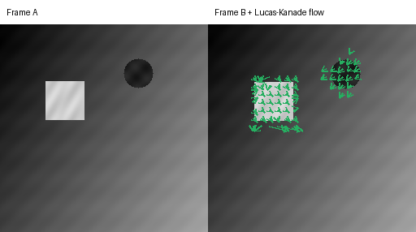
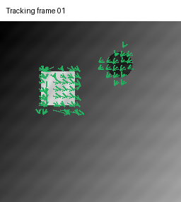

# Chapter 07: Optical Flow and Tracking with Lucas-Kanade

[English](README.md) | [简体中文](README.zh-CN.md)

> A single image shows *where* things are. Two consecutive frames show *how they move*: optical flow turns pixel differences into a motion field.

## Learning objectives

- State the brightness-constancy assumption and derive its linearization;
- Explain why one equation cannot determine two motion components (the aperture problem);
- Build the Lucas-Kanade 2×2 least-squares system from windowed gradient sums;
- Read the smallest eigenvalue as a confidence measure for each pixel;
- Reproduce a known translation and observe when the estimate becomes biased;
- Connect flow fields to tracking, ego-motion, and moving-object cues in driving.

## 1. Brightness constancy and its linearization

Assume the brightness of a scene point does not change as it moves:

```math
I(x, y, t) = I(x+u, y+v, t+1)
```

The pixel at `(x, y)` in frame `t` reappears at `(x+u, y+v)` in frame `t+1`, where `(u, v)` is the displacement. A first-order Taylor expansion gives the **optical flow constraint equation**:

```math
I_x u + I_y v + I_t = 0
```

`I_x` and `I_y` are spatial gradients, `I_t` is the frame difference, and `(u, v)` is what we want. This is one linear equation in two unknowns, so every pixel only constrains motion along its gradient direction.

## 2. The aperture problem and confidence

A single edge has a strong gradient in only one direction, so it can determine the **normal flow** (motion perpendicular to the edge) but not the motion along the edge. A flat region has no gradient at all and gives no constraint. Only a patch with texture in two different directions can determine both `u` and `v`.

The 2×2 structure tensor captures this locally:

```math
A = \begin{bmatrix} \sum I_x^2 & \sum I_x I_y \\ \sum I_x I_y & \sum I_y^2 \end{bmatrix}
```

The smaller eigenvalue of `A` measures how strongly the patch is textured in both directions. A large value means confident flow; a value near zero means a flat region or a single edge, where the flow is ambiguous. This chapter marks those pixels `valid = False`.



The textured rectangle moves down-right by one pixel and the circle moves down-left. Green arrows mark high-confidence flow; the static background produces no arrows. This is exactly the two-class motion cue that a driving scene presents: the world is mostly static, while a few objects move.

## 3. Lucas-Kanade least squares

Inside a small window of size `w×w`, assume all pixels share the same motion `(u, v)`. Each pixel contributes one linear equation, and the window gives `w²` equations for two unknowns. The least-squares solution is:

```math
\begin{bmatrix} \sum I_x^2 & \sum I_x I_y \\ \sum I_x I_y & \sum I_y^2 \end{bmatrix}
\begin{bmatrix} u \\ v \end{bmatrix}
=
-\begin{bmatrix} \sum I_x I_t \\ \sum I_y I_t \end{bmatrix}
```

```python
from vision2autonomy.motion import lucas_kanade_flow

result = lucas_kanade_flow(frame_a, frame_b, window_size=15)
u, v = result.flow[row, column]
confident = result.valid[row, column]
```

The implementation computes spatial gradients with central differences on the average of the two frames, forms `I_t = I_{t+1} - I_t`, then accumulates the five windowed sums with a uniform convolution kernel. Solving the 2×2 system per pixel is closed-form and vectorized.

## 4. What can go wrong — and why

The reference scene was chosen to make the failure modes visible:

- **Large displacements break the linearization.** The Taylor expansion is local. A one-pixel shift of a long-wavelength pattern is recovered accurately; a several-pixel shift of a short-wavelength pattern is not. Real systems use image pyramids (coarse-to-fine) to handle large motion.
- **Hard edges and high-frequency texture bias the estimate.** A checkerboard or thin stripes move several pixels relative to their period, so the first-order model is wrong at the edges and the least-squares solution is pulled toward a smaller value.
- **Noise attenuates the estimate.** Measurement noise in the gradients acts like errors-in-variables and shrinks the flow toward zero.
- **Texture fixed to image coordinates hides interior motion.** If a pattern does not move with the object, only the occlusion boundary changes between frames; the object interior looks static. A correct scene must shift the texture with the object.

Each of these failures is a lesson, not just a bug: they motivate pyramids, robust estimation, and careful data acquisition.

## 5. Reproduce

```bash
python -m pip install -e ".[dev]"
python -m vision2autonomy.examples.reference_images
pytest tests/test_lucas_kanade.py -q
```

The animated teaching asset shows the same scene frame by frame:



## 6. Conventions and common failures

| Quantity | Convention | Frequent mistake |
|---|---|---|
| flow `(u, v)` | displacement from frame `t` to `t+1`, `(column, row)` | reversing the frame order or the axis order |
| gradients | central difference on the average frame | using only one frame's gradient, which biases the estimate |
| `I_t` | `I(x, y, t+1) - I(x, y, t)` | using `I_t = I_t - I_{t+1}` and flipping the flow sign |
| confidence | smaller eigenvalue of `A` | treating determinant or `I_t` magnitude as confidence |
| window | odd size `>= 3` | using a window too small for the expected displacement |
| validity | border and low-texture pixels excluded | trusting flow in flat or one-dimensional regions |

## 7. Autonomous-driving connection

Optical flow is the bridge between geometry and dynamics in a driving scene:

- **Multi-object tracking:** flow associates a vehicle or pedestrian across frames, giving a smooth trajectory between detections.
- **Ego-motion estimation:** when the camera moves, the static world produces a flow pattern described by the camera motion; fitting that pattern yields visual odometry.
- **Moving-object segmentation:** after compensating for ego-motion, residual flow highlights objects moving independently — a pedestrian crossing or an overtaking vehicle.
- **Temporal consistency:** detections that do not move consistently across frames are likely false positives.

The failures matter in practice: lane lines are edges nearly parallel to their motion (aperture problem), high-speed driving creates large displacements that break single-scale Lucas-Kanade, and occlusion boundaries generate spurious flow. Production systems combine pyramids, robust estimation (RANSAC), and sensor fusion to handle them.

## 8. Check your understanding

1. Why does one edge pixel give one equation for two unknowns?
2. What does the smaller eigenvalue of the structure tensor measure?
3. Why does a one-pixel shift of a long-wavelength pattern work better than a five-pixel shift of a checkerboard?
4. If the flow sign is wrong, which intermediate quantity was most likely flipped?
5. In a driving scene, why is it useful to subtract the ego-motion flow before looking for moving objects?