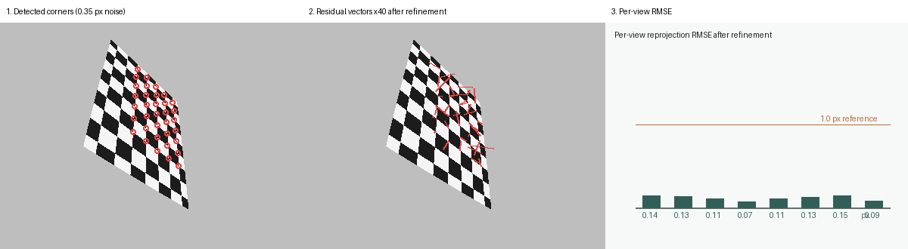
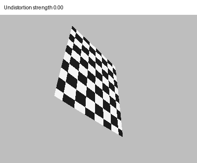

# 第 08 章：相机标定与镜头畸变

[English](README.md) | [简体中文](README.zh-CN.md)

> 相机把三维世界映射到二维像素，但便宜的镜头会弯曲这张地图。标定恢复出精确的映射关系，让像素真正变成“米”。

## 学习目标

- 掌握针孔模型与 Brown-Conrady 径向-切向畸变模型；
- 理解为什么几幅平面棋盘格照片就能约束内参矩阵；
- 实现 Zhang 标定法：从平面单应矩阵闭式求解 `K`；
- 通过最小化重投影误差，联合精化内参、畸变与每幅图的位姿；
- 对图像去畸变，并量化残差；
- 把标定与测距、车道几何、传感器融合等驾驶场景联系起来。

## 1. 为什么要标定？

前面几章的几何推导都假设相机矩阵已知。但实际中它并不已知：焦距随镜头和变焦环变化，主点并不严格在图像中心，广角镜头还会把直线拍弯。当系统报告“前车距离 8.4 米”时，它其实默认了标定好的内参——焦距偏差 2%，测距就偏差 2%，在高速公路上这比一条车道还宽。

标定正是把像素换算成米的那个环节：

- **双目与三角化**：需要 `K` 才能把视差换算成深度；
- **车道几何**：需要去畸变后的图像，车道线才保持直线、曲率才测得准；
- **传感器融合**：与毫米波雷达、激光雷达或高精地图融合，需要统一的度量坐标系；
- **视觉里程计**：需要 `K` 才能把像素运动换算成相机运动。

## 2. 从世界到像素：针孔加畸变

理想针孔模型用 3×4 投影矩阵把世界点映射到图像，但对单相机来说，把映射拆成两步更直观：

```math
\begin{bmatrix} u \\ v \\ 1 \end{bmatrix}
\sim
K \begin{bmatrix} R & t \end{bmatrix}
\begin{bmatrix} X \\ Y \\ Z \\ 1 \end{bmatrix},
\qquad
K = \begin{bmatrix} f_x & 0 & c_x \\ 0 & f_y & c_y \\ 0 & 0 & 1 \end{bmatrix}
```

`K` 中 `f_x`、`f_y` 是焦距，`(c_x, c_y)` 是主点；`R`、`t` 描述相机在世界中的位姿。真实镜头会偏离这条直线，越靠近图像边缘越明显。Brown-Conrady 模型在*归一化坐标* `(x, y)`（像素坐标除以 `K`）下描述这种偏移：

```math
r^2 = x^2 + y^2
```

```math
x_d = x\,(1 + k_1 r^2 + k_2 r^4) + 2 p_1 x y + p_2 (r^2 + 2 x^2)
```

```math
y_d = y\,(1 + k_1 r^2 + k_2 r^4) + p_1 (r^2 + 2 y^2) + 2 p_2 x y
```

`k_1, k_2` 是径向系数：`k_1 < 0` 是桶形畸变（直线向外鼓），`k_1 > 0` 是枕形畸变。`p_1, p_2` 描述切向畸变，通常由镜头与传感器平面不严格平行引起。

```python
from vision2autonomy.geometry import distort_points, undistort_points

normalized = np.array([[0.5, 0.3], [-0.4, 0.6]])
distorted = distort_points(normalized, k1=-0.22, k2=0.05, p1=0.004, p2=-0.003)
ideal = undistort_points(distorted, k1=-0.22, k2=0.05, p1=0.004, p2=-0.003)
```


上面的合成标定板用本章贯穿始终的逆映射管线渲染：每个像素先去除畸变、再反投影到棋盘格平面并采样。这正是真实镜头拍摄标定板的过程。

## 3. Zhang 标定法：平面单应矩阵给出 K

买一个三维标定靶很贵，打印一张棋盘格却很便宜。Zhang 的关键洞察是：只要从多个视角拍摄平面标定板，就足以恢复内参。

当目标平面取 `Z = 0` 时，投影退化为单应矩阵 `H`：

```math
s \begin{bmatrix} u \\ v \\ 1 \end{bmatrix} = K \begin{bmatrix} r_1 & r_2 & t \end{bmatrix} \begin{bmatrix} X \\ Y \\ 1 \end{bmatrix} = H \begin{bmatrix} X \\ Y \\ 1 \end{bmatrix}
```

每个视角给出一张 `3×3` 的 `H`（本章用第 04 章的归一化 DLT 估计）。因为 `r_1`、`r_2` 正交且等长，每张单应矩阵对对称矩阵 `B = K^{-T} K^{-1}` 施加两个二次约束。这两个约束对 `B` 的六个独立元素是线性的，因此把至少三个视角的约束堆叠起来，得到一个线性方程组，其零空间向量就是 `B`。从 `B` 提取 `K` 是闭式操作：

```python
from vision2autonomy.geometry import estimate_homography_dlt, estimate_intrinsics, estimate_view_pose

homographies = [estimate_homography_dlt(object_points[:, :2], view) for view in views]
intrinsics = estimate_intrinsics(homographies)
rotation, translation = estimate_view_pose(intrinsics, homographies[0])
```

同一批单应矩阵还能恢复每个视角的旋转与平移，作为非线性优化的初值。

## 4. 非线性精化：重投影误差

线性估计忽略了畸变，并且逐视角独立求解。最后一步把所有参数放在一起最小化重投影误差——内参 `(f_x, f_y, c_x, c_y)`、畸变 `(k_1, k_2, p_1, p_2)`，以及每个视角的旋转与平移：

```math
\min_{K, k, \{R_i, t_i\}} \sum_i \sum_j \| \operatorname{proj}(X_j; K, k, R_i, t_i) - x_{ij} \|^2
```

本章从零实现 Levenberg-Marquardt：带阻尼的 Gauss-Newton 迭代，雅可比矩阵用有限差分估计。阻尼项让算法在离解远时接近梯度下降、离解近时接近 Gauss-Newton，这正是它在线性初值不理想时依然稳健的原因。

```python
from vision2autonomy.geometry import calibrate_camera, reprojection_errors

result = calibrate_camera(views, object_points, iterations=40)
print(result.intrinsics)     # 恢复出的 K
print(result.distortion)     # 恢复出的 (k1, k2, p1, p2)
print(result.rmse)           # 总体重投影 RMSE（像素）
```




教学场景加入了 0.35 像素的角点噪声，模拟真实角点检测器的输出。精化后残差向量在图中放大了 40 倍；逐视角 RMSE 稳定低于 0.5 像素，恢复出的焦距与真值只差几个像素。

## 5. 复现

```bash
python -m pip install -e ".[dev]"
python -m vision2autonomy.examples.reference_images
pytest tests/test_calibration.py -q
```

下面的动图展示用估计出的模型逐步对桶形畸变图像去畸变——注意网格如何从边缘开始变直：



## 6. 约定与常见错误

| 量 | 约定 | 常见错误 |
|---|---|---|
| 像素坐标 | `(x, y)` = `(列, 行)`，原点在左上角 | 交换坐标轴 |
| 归一化坐标 | 像素坐标除以 `K` | 与原始像素混淆 |
| 畸变符号 | `k_1 < 0` 桶形，`k_1 > 0` 枕形 | 符号弄反，直线朝反方向弯 |
| 去畸变 | 用*正向*畸变模型找源像素 | 连续两次逆变换，误差叠加 |
| 单应矩阵 | 平面坐标 `(X, Y)` 到像素 | 把 `Z ≠ 0` 的三维点喂给 DLT |
| 视角数量 | 至少 3 个，位姿要多样 | 所有照片几乎同一角度拍摄 |
| 精化 | 一个联合最小二乘问题 | 逐视角独立优化、忽略畸变 |
| RMSE | 所有视角所有角点的均方根，单位像素 | 只报单视角或最大值 |

## 7. 与自动驾驶的联系

标定支撑着车辆做出的每一个“米级”结论：

- **距离与车速**：焦距标定偏差会放大到所有单目、双目深度估计上，直接影响制动与接管决策。
- **车道几何**：去畸变让车道边界保持直线，曲率与横向偏移才基于正确的几何计算。
- **传感器融合**：内参和外参把相机检测、毫米波点迹、激光雷达点云放到同一坐标系，才能关联与占据栅格。
- **在线安全**：量产系统会重估或监控标定漂移（振动、热胀冷缩、摄像头被碰），因为高速下哪怕 1% 的深度偏差都不可忽视。

## 8. 自测题

1. 为什么平面棋盘格就够标定，而不需要三维标定靶？
2. `k_1` 与 `p_1` 各自描述什么？在图像中哪里最明显？
3. Zhang 法从每张单应矩阵中提取了哪两个正交约束？
4. 即使没有畸变，为什么一幅图也不足以恢复 `K`？
5. 如果去畸变后图像弯得更厉害，最可能是哪一步把映射方向写反了？