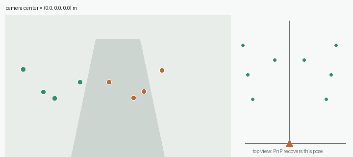
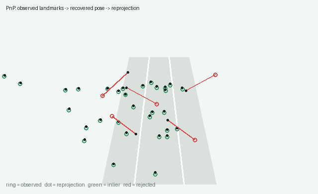
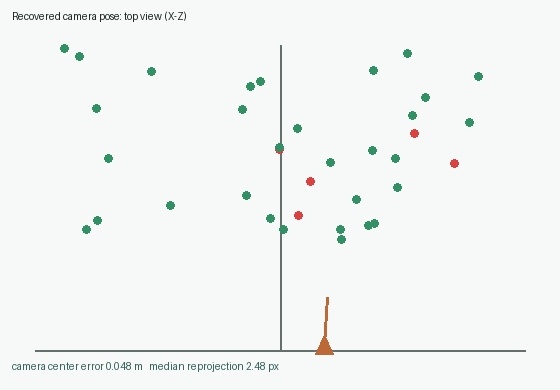

# Chapter 09: PnP Camera Pose Estimation

[English](README.md) | [简体中文](README.zh-CN.md)

> Calibration explains how a camera turns rays into pixels. PnP runs the
> geometry in the opposite direction: known 3-D landmarks and their 2-D
> observations reveal where the camera is and where it is looking.



## Learning objectives

- distinguish intrinsics, extrinsics, translation, and camera center;
- derive the 3-D/2-D DLT system from the projection equation;
- project a noisy DLT matrix back onto the rotation group SO(3);
- measure pose quality with pixel reprojection error;
- reject incorrect landmark matches with RANSAC;
- connect PnP to localization and visual odometry.

Prerequisites: Chapter 04 RANSAC, Chapter 05 pinhole cameras, and Chapter 08
calibration and undistortion.

## 1. The PnP problem

Given world points `X`, observed pixels `x`, and calibrated intrinsics `K`,
estimate the world-to-camera rotation and translation:

```text
s [u, v, 1]ᵀ = K [R | t] [X, Y, Z, 1]ᵀ
```

The translation `t` is not the camera position in world coordinates. The
camera center is

```text
C = -Rᵀ t
```

because the camera center must satisfy `R C + t = 0`.

## 2. Re-explain the observations with a virtual camera

A map may contain sign corners, lamp-post attachments, and static building
features. Once they are matched to image pixels, a candidate pose can project
the map back into the image. The correct pose makes those reprojections agree
with the measurements.



Rings are observations, black dots are reprojections, green matches support
the pose, and red matches are rejected.

## 3. Remove the intrinsics first

Multiplying pixels by `K⁻¹` produces normalized camera rays:

```text
[x, y, 1]ᵀ ∼ K⁻¹ [u, v, 1]ᵀ
s [x, y, 1]ᵀ = [R | t] Xₕ
```

This separates lens geometry from rigid camera motion.

## 4. Derive DLT

Temporarily treat `[R | t]` as a general `3×4` matrix `P` with rows
`p₁ᵀ, p₂ᵀ, p₃ᵀ`:

```text
x = (p₁ᵀ Xₕ) / (p₃ᵀ Xₕ)
y = (p₂ᵀ Xₕ) / (p₃ᵀ Xₕ)
```

Each correspondence contributes two linear rows:

```text
[ Xₕᵀ   0     -xXₕᵀ ]
[  0    Xₕᵀ   -yXₕᵀ ]
```

Stacking the rows gives `A p = 0`. The right singular vector associated with
the smallest singular value is the DLT solution. Because a homogeneous
`3×4` matrix has 11 effective degrees of freedom, at least six
correspondences are required.

## 5. Normalize the world points

Road coordinates may be tens of metres while the homogeneous coordinate is
one. Chapter 09 translates the points to their centroid and scales their mean
distance to `√3`, solves the system, and removes that normalization afterward.
This is the same numerical idea used by normalized homography and eight-point
estimation.

## 6. Turn the DLT matrix into a pose

Noise means the left `3×3` DLT block does not exactly satisfy

```text
RᵀR = I
det(R) = +1
```

If `A = U Σ Vᵀ`, the nearest rotation is `R = U Vᵀ`. The mean singular value
recovers the common DLT scale used for translation.

The global sign also matters during this conversion. Although `P` and `-P`
describe the same projective mapping, only one sign gives a
positive-determinant rotation block. Selecting the sign first avoids a subtle
180-degree pose flip under small pixel noise.

## 7. Reprojection error

The common evaluation language is pixel error:

```text
x̂ᵢ = project(K, R, t, Xᵢ)
eᵢ = ||x̂ᵢ - xᵢ||₂
```



This educational implementation provides a linear initializer and SO(3)
projection. A production solver normally continues with non-linear
reprojection-error refinement.

## 8. Robust PnP with RANSAC

Repeated signs, dynamic vehicles, and bad descriptors create false landmark
matches. The implementation repeatedly:

1. samples a small correspondence subset;
2. estimates a normalized-DLT pose;
3. scores every correspondence by reprojection error;
4. keeps the largest, lowest-error consensus;
5. re-estimates from all inliers.

Six points are the algebraic minimum. With enough data, hypotheses use eight
points to reduce sensitivity to noise and near-planar layouts.

## 9. Run it

```bash
python -m pip install -e ".[dev]"
python -m pytest tests/test_pose.py -q
python -m vision2autonomy.examples.reference_images
```

```python
from vision2autonomy.geometry import (
    camera_center,
    estimate_pose_dlt,
    pose_reprojection_errors,
    ransac_pnp,
)

rotation, translation = estimate_pose_dlt(world_points, pixels, intrinsics)
center = camera_center(rotation, translation)

robust = ransac_pnp(
    world_points,
    pixels_with_bad_matches,
    intrinsics,
    threshold=3.0,
    max_iterations=800,
    seed=7,
)
```

## 10. Failure modes

| Situation | Why it fails | Response |
|---|---|---|
| Nearly coplanar landmarks | General DLT is ill-conditioned | Use planar PnP/homography or varied-height landmarks |
| Features occupy a tiny region | Weak rotation and translation constraints | Spread landmarks over image and depth |
| Wrong calibration | Camera rays are wrong before PnP starts | Verify Chapter 08 reprojection error |
| Dynamic features dominate | Static-world assumption is broken | Semantic filtering and RANSAC |
| Linear accuracy is insufficient | DLT does not minimize pixel error directly | Add non-linear pose refinement |
| Wrong map scale | Translation inherits the wrong scale | Verify map units and coordinate frames |

## 11. Autonomous-driving relevance

- **Map localization:** align signs, poles, lanes, and building landmarks with
  a prior map.
- **Visual odometry:** match current pixels to previously triangulated 3-D
  points; consecutive PnP poses form a trajectory.
- **Sensor fusion:** provide a visual observation to an IMU, wheel-speed, and
  GNSS state estimator.
- **AR debugging:** correct pose keeps map lanes and sensor projections fixed
  on the real road.
- **Health monitoring:** falling inlier ratio or rising reprojection error can
  reveal occlusion, dynamics, calibration drift, or map inconsistency.

PnP is geometric self-localization, not a complete driving-localization
system. The next chapter will connect matching, triangulation, and PnP into a
visual-odometry pipeline with scale, drift, and trajectory evaluation.

## 12. Check your understanding

1. Why is `t` not the camera center?
2. Why does multiplying by `K⁻¹` simplify PnP?
3. Why does each correspondence provide two constraints?
4. Why must the DLT rotation block be projected onto SO(3)?
5. Why are ground-only landmarks difficult for general DLT?
6. What happens when the RANSAC threshold is too strict or too loose?
