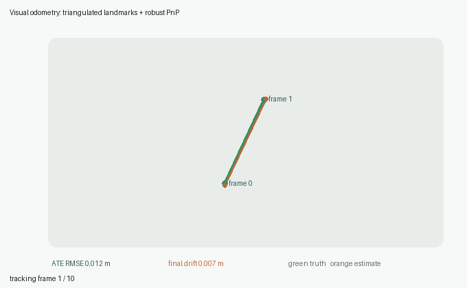
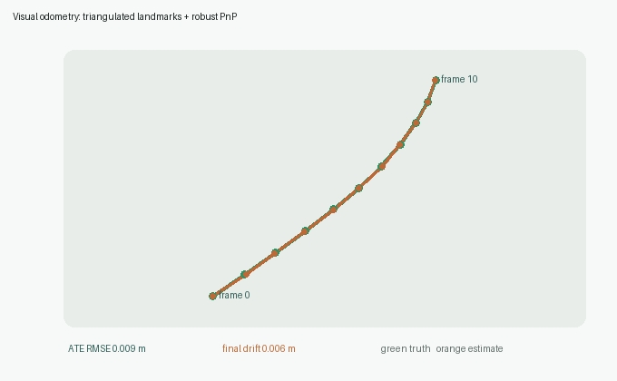
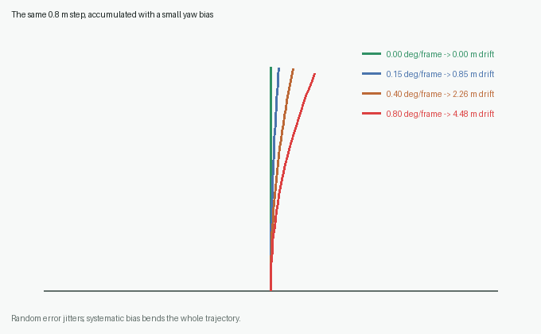

# 第 10 章：视觉里程计、轨迹与漂移

[English](README.md) | [简体中文](README.zh-CN.md)

> PnP 给出一个时刻的相机位姿；视觉里程计把连续时刻连接起来，形成车辆走过的轨迹。真正困难的不是“算出一次运动”，而是让许多次小误差不要悄悄长成大偏差。



## 学习目标

- 把角点、匹配、三角化与 PnP 串成一条可运行的视觉里程计链路；
- 明确世界到相机、相机到世界和相邻帧变换的方向；
- 正确累积旋转和平移，而不是直接相加矩阵元素；
- 区分随机误差、系统偏差、局部误差与累计漂移；
- 理解双目/RGB-D 的米制尺度与单目尺度不确定性；
- 使用 ATE、相对平移误差和轨迹对齐评价结果；
- 说明视觉里程计在自动驾驶定位系统中的作用和边界。

前置章节：第 04 章特征匹配、第 05 章三角化、第 07 章光流、第 08 章标定、第 09 章 PnP。

## 1. 视觉里程计到底是什么？

汽车的机械里程计根据车轮转动估计行驶距离。**视觉里程计（Visual Odometry, VO）**根据相机图像的变化估计相机运动：

```text
图像 I₀, I₁, I₂, ...
        │
        ▼
跨帧特征关联
        │
        ▼
相邻帧或地图坐标中的相机位姿
        │
        ▼
C₀, C₁, C₂, ... 车辆轨迹
```

“Odometry”意味着它主要依赖连续局部运动。它通常很平滑、短时间很准确，但如果没有全局约束，误差会随路程累计。

## 2. 本章实现的是哪一种 VO？

视觉里程计有几条常见路线：

| 路线 | 深度来自哪里 | 运动怎样估计 | 尺度 |
|---|---|---|---|
| 单目 2D–2D | 对极几何间接恢复 | Essential Matrix | 只能确定到比例 |
| 双目 3D–2D | 左右相机三角化 | PnP | 米制 |
| RGB-D 3D–2D | 深度传感器 | PnP | 米制 |
| 3D–3D | 两帧都具有深度 | 刚体配准 | 米制 |

本章选择最适合串联前面课程的路线：

```text
第 05 章双目三角化
        ↓
以第 0 帧相机坐标系建立三维路标
        ↓
第 04/07 章匹配或跟踪当前像素
        ↓
第 09 章 RANSAC PnP 求当前相机位姿
        ↓
把每帧相机中心连成米制轨迹
```

代码里的三维路标固定在第 0 帧坐标系中，所以后续每次 PnP 都直接得到“第 0 帧世界 → 当前相机”的外参。

## 3. 三种容易混淆的量

设

```text
T_cw = [R_cw | t_cw]
```

表示把世界点变成相机点：

```text
X_c = R_cw X_w + t_cw
```

那么：

- `T_cw`：世界到相机；
- `T_wc = T_cw⁻¹`：相机到世界；
- 相机中心 `C_w = -R_cwᵀ t_cw`。

如果 `T_10` 表示相机 0 到相机 1，`T_21` 表示相机 1 到相机 2，那么

```text
T_20 = T_21 T_10
```

矩阵乘法的顺序来自函数复合，不能交换。代码提供：

```python
pose_matrix(...)
invert_pose(...)
compose_poses(...)
accumulate_relative_poses(...)
trajectory_from_poses(...)
```

### 为什么平移不能简单相加？

第二段平移通常写在第二帧的坐标轴里。如果车辆已经转弯，这个“向前 1 米”与第一帧坐标中的方向不同。必须先通过旋转把方向放到同一坐标系，再累积。

## 4. 从图像到轨迹的完整数据流

一个教学级双目 VO 循环可以写成：

```text
1. 标定并去畸变左右图像
2. 检测稳定角点
3. 左右匹配，三角化初始三维路标
4. 在下一帧匹配或光流跟踪这些路标
5. RANSAC PnP 求当前 R、t
6. 计算相机中心 C = -Rᵀt
7. 删除丢失、动态或重投影误差过大的路标
8. 三角化新路标，补充跟踪集合
9. 重复并记录轨迹
```

本章的 `pnp_odometry` 聚焦第 5–6 步和轨迹输出。每帧观测数组与三维路标逐行对应，缺失观测用 `NaN` 表示。

## 5. 执行结果怎样看？



- 绿色：模拟车辆的真实轨迹；
- 橙色：带像素噪声、漏跟踪和错误匹配后的 PnP 轨迹；
- 灰线：每一帧的位置误差；
- ATE RMSE：整个序列的位置均方根误差；
- final drift：最后一帧与真值的距离。

图中的结果很接近，并不意味着 VO 不会漂移。这个短序列反复观察同一批固定三维路标，更接近“局部地图跟踪”。当旧路标离开视野、系统不断用带误差的新路标替换它们时，坐标基准本身也会缓慢漂移。

## 6. 漂移是怎样长出来的？

假设每帧只多估了 `0.4°` 的偏航，单帧看几乎没有区别。但下一帧的“向前”已经朝错了一点，随后每一步都沿着错误方向继续：



### 随机误差

像素噪声有时向左、有时向右，轨迹常表现为抖动。增加特征、稳健估计和优化可以部分平均掉它。

### 系统偏差

焦距误差、双目基线误差、时间不同步、固定的偏航偏差会持续朝同一方向作用。它不会被简单平均，通常形成弯曲、缩放或不断偏离的轨迹。

### 为什么旋转误差尤其危险？

位置误差影响当前点；旋转误差会改变后续所有平移的方向。因此极小的角度偏差在长距离上也会变成明显横向偏移。

## 7. 单目为什么没有天然米制尺度？

两帧单目图像的 Essential Matrix 可以恢复旋转 `R` 和平移方向 `t/||t||`，却无法仅从图像判断车辆移动了 0.5 米还是 5 米。把场景和相机运动同时放大十倍，投影图像仍然相同。

尺度来源可以是：

- 双目已知基线；
- RGB-D 深度；
- IMU 与轮速；
- 已知物体或相机高度；
- 地图地标；
- 多帧优化中的其他度量约束。

因此单目轨迹评价常允许一个全局尺度对齐；双目或融合系统一般不应随意缩放后再报米制精度。

## 8. ATE：整条轨迹偏了多少？

Absolute Trajectory Error 比较每个估计位置与参考位置：

```text
ATE_RMSE = sqrt(mean(||p̂ᵢ - pᵢ||²))
```

但两个系统可能使用不同坐标原点和朝向，所以通常先对齐轨迹。

本章实现 Umeyama 对齐：

```text
p_aligned = s R p_est + t
```

- 米制双目：`with_scale=False`，只允许旋转和平移；
- 单目：`with_scale=True`，允许一个全局尺度；
- 如果每个局部区间单独缩放，指标会掩盖真正的尺度漂移，因此不能这样做。

## 9. 相对误差：局部运动哪里出了问题？

ATE 关注全局位置，Relative Pose Error 关注固定间隔内的运动差：

```text
Δp_est(i) = p_est(i+δ) - p_est(i)
Δp_ref(i) = p_ref(i+δ) - p_ref(i)
e_rel(i) = ||Δp_est(i) - Δp_ref(i)||
```

短间隔 RPE 高，说明逐帧估计本身不稳；短间隔低但 ATE 随时间升高，说明很多小偏差在稳定累积。两种指标应该一起看。

## 10. 运行代码

```bash
python -m pip install -e ".[dev]"
python -m pytest tests/test_odometry.py -q
python -m vision2autonomy.examples.reference_images
```

```python
from vision2autonomy.geometry import (
    absolute_trajectory_error,
    align_trajectory,
    pnp_odometry,
    relative_translation_error,
)

result = pnp_odometry(
    landmarks_3d,
    observations_by_frame,
    intrinsics,
    threshold=3.5,
    max_iterations=600,
    seed=9,
)

ate = absolute_trajectory_error(
    result.centers,
    reference_centers,
    align=True,
    with_scale=False,
)

local_errors = relative_translation_error(
    result.centers,
    reference_centers,
    delta=1,
)
```

`OdometryResult` 还包含每帧内点数和内点重投影误差中位数。它们是很有价值的健康信号：位置尚未明显漂移前，匹配质量往往已经开始恶化。

## 11. 什么时候会失败？

| 场景 | 发生什么 | 可行对策 |
|---|---|---|
| 低纹理路面、隧道墙 | 可跟踪角点不足 | 更强特征、扩大时间窗口、融合 IMU |
| 大量车辆或行人 | 动态点违反静态世界 | 语义掩膜、运动一致性过滤 |
| 高速旋转或运动模糊 | 匹配/光流断裂 | 更短曝光、更高帧率、IMU 预测 |
| 近似纯旋转 | 三角化基线不足 | 延迟初始化、结合深度或 IMU |
| 重复纹理 | 错误匹配形成假运动 | 双向检验、RANSAC、局部地图 |
| 标定或同步偏差 | 形成持续系统漂移 | 在线监控标定、硬件同步 |
| 长时间无回访 | 累计误差无法归零 | 回环检测和全局图优化 |

## 12. 与自动驾驶的关系

视觉里程计可以提供：

- **短时连续运动**：在 GNSS 遮挡的隧道、城市峡谷中维持平滑定位；
- **车身速度和转向线索**：为感知时序融合、跟踪与运动补偿提供自车运动；
- **地图匹配初值**：帮助高精地图定位缩小搜索范围；
- **传感器故障冗余**：与 IMU、轮速、GNSS 和激光里程计互相校验；
- **感知坐标稳定**：把连续帧检测结果变换到统一局部坐标系。

但量产自动驾驶不会只依赖纯视觉里程计。更完整的定位系统通常是：

```text
视觉 / 激光里程计
        +
IMU 预积分
        +
轮速
        +
GNSS / 地图约束
        +
回环与图优化
```

## 13. 下一步

到这里，传统几何主线已经形成闭环：

```text
像素 → 特征 → 匹配 → 三维 → 位姿 → 轨迹
```

下一阶段进入神经网络基础，但仍坚持从零理解：先实现最小的全连接网络、反向传播、损失函数和卷积层，再使用 PyTorch 验证，不会直接从大型检测模型开始。

## 14. 自测题

1. 为什么世界到相机的 `t` 不能直接当作车辆位置？
2. 为什么相对位姿的乘法顺序不能交换？
3. 随机像素噪声和固定焦距误差会形成怎样不同的轨迹？
4. 为什么旋转误差比同量级的位置误差更容易累计？
5. 单目轨迹为什么允许尺度对齐，而双目米制结果通常不允许？
6. ATE 很高但逐帧 RPE 很低可能说明什么？
7. 回环检测为什么能纠正漂移，却不能保证所有局部匹配本身正确？
