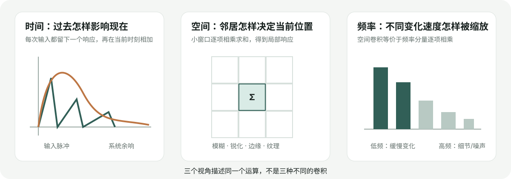

# Convolution Special: From Intuition and Physics to Images

[English](README.md) | [简体中文](README.zh-CN.md)

> The goal is not to memorize a formula. It is to form a stable mental picture whenever you see the word convolution.

## The conclusion first

Convolution is neither time evolution nor blur by definition:

> **It moves one local influence rule to every position and sums the weighted contributions of surrounding input.**

The position may be time, image coordinates, video space-time, or a 3D voxel grid.



## Sliding weighted sums

For `x=[0,0,3,0,0]` and an influence rule `h=[1,0.5]`, the value 3 creates an output of 3 now and 1.5 one step later. With many nonzero inputs, each produces a shifted, scaled copy of `h`, and the copies add:

```math
y[n]=\sum_k x[k]h[n-k].
```

Read each term as the size of input `k` multiplied by how strongly that input can influence output `n`.

## Why time systems produce convolution

A unit hand clap in a room produces an entire echo response `h(t)`. A clap at time `τ` shifts it to `h(t-τ)`; clap strength `x(τ)` scales it. Adding the echoes from all instants gives

```math
y(t)=\int x(\tau)h(t-\tau)d\tau.
```

This interpretation holds for linear, time-invariant systems. Time gives convolution the meaning “past inputs influence the present”; convolution itself does not require time.

## Why the kernel flips

The term `h[n-k]` reverses the rule as `k` increases, then shifts it to output position `n`. This supports properties such as `x*h=h*x`. Sliding without flipping is cross-correlation. Image and deep-learning libraries often call cross-correlation convolution. Symmetric Gaussian kernels are unaffected; asymmetric kernels may change sign or orientation.

## What convolution means for images

For a 2D image,

```math
O(x,y)=\sum_i\sum_j I(x-i,y-j)K(i,j).
```

There is no past here. Neighboring pixels determine the current output under a spatial rule.


| Local question | Large response means | Use |
|---|---|---|
| What is the neighborhood average? | local brightness | smoothing |
| Is the left dark and right bright? | vertical transition | edge detection |
| Does the center differ from neighbors? | local detail | sharpening |
| Does this neighborhood resemble a pattern? | local match | feature extraction |

Images suit convolution because nearby pixels are related and because the same edge detector should work everywhere. This is translation equivariance: shifting the input shifts the response map.

## Diffusion and virtual time

Repeated infinitesimal Gaussian smoothing can be viewed as evolution under the heat equation,

```math
\partial I/\partial t=\nabla^2 I.
```

This is one valid connection between convolution and evolution: a particular kernel describes a differential equation's solution over virtual time. It does not make every image convolution a temporal process.

## Frequency view

The convolution theorem says

```math
\mathcal{F}(x*h)=\mathcal{F}(x)\mathcal{F}(h).
```

Gaussian smoothing attenuates high frequencies; sharpening raises some of them; derivative kernels suppress constants and emphasize rapid changes. Frequency space is another view of the same operation.

## CNNs

Classical vision designs kernels such as Gaussian and Sobel. CNNs learn kernel values from data. Early layers respond to edges and textures; deeper layers combine local responses into parts and objects. Most frameworks implement cross-correlation, while retaining the name convolution.

## Common misconceptions

1. Convolution means blur — false; blur is one kernel family.
2. Convolution always means past affects present — false; that meaning comes from causal time systems.
3. One small kernel recognizes a whole object — generally false; objects emerge from layers and spatial combinations.

## How to read the formula

For `y[n]=Σ x[k]h[n-k]`, ask: which output `n` am I computing, how large is input `k`, how far is it from `n`, what weight does that distance receive, and what is the sum of all contributions?

## Check your understanding

1. Why do averaging weights usually sum to one?
2. Why does a zero-sum kernel return zero on a constant image?
3. Why is Gaussian unchanged by flipping?
4. Why can sharpening amplify noise?
5. What happens to the response map if the image shifts right?

If you can answer using movement, weighting, summation, and a shared local rule, you understand the core idea.

## Continue

- [Chapter 01 implementation](../01_image_foundations/README.md)
- [Chapter 02 Sobel and Canny](../02_edge_detection/README.md)
- [Interactive 3×3 calculator](https://woofww.github.io/Vision2Autonomy/#convolution-lab)
